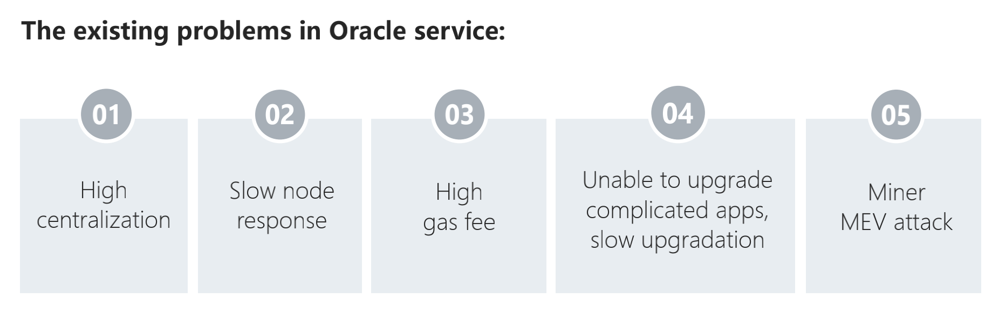

### What is Ares?

Ares is a decentralized oracle solution that implements Oracle data on-chain and on-chain verification. It provides safe and reliable data services for the interconnection and digital economy in the Web3.0 era.

### Ares features

**Openness**

You only need to pledge a small amount of ARES to become an aggregator node of the ARES network to ensure the wide range and distributed characteristics of data sources.

**Fairness**
1. ARES network randomly selects aggregator nodes to provide data through VRF, which effectively guarantees the fairness and decentralization of nodes. 

2. ARES network pioneered the compensation scheme. When data demanders use the ARES network to verify the data provided by the multi-layer security mechanism and suffer business losses, they can initiate a proposal to the ARES Treasury to apply for certain compensation.

**Security**
1. After the aggregation module submits the price to the chain, it performs on-chain aggregation of multiple data sources to prevent individual aggregators from doing evil and ensure the authenticity of the data. 

2. After the selected aggregator node provides data, any node can initiate a challenge by paying a certain amount of GAS, questioning the authenticity of the data, and the arbitration committee will deal with the challenger's queries in a timely manner. It effectively avoids the possibility of nodes doing evil, and also avoids the possibility of challenger nodes doing evil, and the on-chain aggregation function of the ARES network adds another layer of protection to the data source.

**Real-time**

ARES ensures the data requester can quickly receive feedback results in real-time after initiating a request by verifying and sharing the security consensus of the Polkadot network on the data chain.

### About $Ares

Exchanges: [Gate](https://www.gateio.pro/trade/ARES_USDT)、[MEXC](https://www.mexc.com/exchange/ARES_USDT)、[Hotbit](https://www.hotbit.io/exchange?symbol=ARES_USDT)、[BKEX](https://www.bkex.com/trade/ARES_USDT)、[BitMart](https://www.bitmart.com/trade/en?symbol=ARES_USDT&layout=basic)、[Uniswap](https://app.uniswap.org/#/swap?outputCurrency=0x358AA737e033F34df7c54306960a38d09AaBd523&use=V2&lng=en-US)

Total amount: 1 Billion

Circulation: 232,932,106.83 ARES

Initial price: 0.006U

$Ares ETH Contract address: 0x358AA737e033F34df7c54306960a38d09AaBd523

$Ares BSC Contract address: 0xf9752A6E8A5E5f5e6EB3aB4e7d8492460fb319f0

### How to earn $Ares

Community activities will issue Airdrops, cash red envelopes, and peripheral gifts from time to time. 
Join Trojan/Iliad staking.
Community volunteers, community ambassadors, and technical ambassadors. 
It will be rewarded by auctioning KSM/DOT slots.

### Roadmap

Currently, Ares has launched the first phase version of the gladios testnet. At the same time, Ares pledged mining on Ethereum and BSC has been fully launched. Next, we will have more Oracle functions online:

1.Distributed data source weight adjustment

2.Random node selection based on VRF

3.Aggregation of multi-node prices in the chain

4.Challenger's chain verification

5.Wasm Contract ecology

At the same time, we will also focus on brand promotion and operation, and reach strategic cooperation with more ecological projects. 
 
Ares Protocol 2021 plan is mainly divided into several aspects：  

1.The launch of the next version of Gladios Testnet is related to the advancement of product function research and development. The Defi project can be provided with a safer and more reliable price service.    
2.Community development, build the Ares Protocol community ambassador and technical ambassador, let more friends who want to know Ares Protocol join the family of God of War. If you have your own unique insights on publicity and technology, you are welcome to contact us at any time.  
3.At present, we are also actively cooperating closely with ecological projects. Such as mxc polar domain, trustbase, bandot and other projects.  
4.Ares will set up the WASM Ecological Fund. Welcome to use Wasm contract to build Defi application. You can get all kinds of data on the chain for free. If you are interested, you may apply for our funding.  
5.In Polkadot and Kusama parachain slot auctions, Ares paid close attention to this development and has already participated in the crowd loans of Dot and KSM.  
6.Ares Eco-Marathon welcomes individuals or technical teams who use Ares Oracle services to participate in the ecological construction and will provide generous financial rewards to participants.  

### Ares oracle platform links

Website: https://Aresprotocol.io/

Staking: https://trojan.Aresprotocol.io/

Email: info@Aresprotocol.io

Telegram: https://t.me/Aresprotocol

Twitter: https://twitter.com/AresProtocolLab

Medium: https://Aresprotocollab.medium.com

Discord: https://discord.gg/cqduK4ZNaY

Github: https://github.com/Aresprotocols

Reddit: https://www.reddit.com/r/AresProtocolLabs/

Facebook: https://www.facebook.com/groups/Aresprotocollabs

Instagram: https://www.instagram.com/aresprotocollab/

Youtube：https://www.youtube.com/channel/UCgwY4NwkoP8Hx1Fqmp_rJUw
