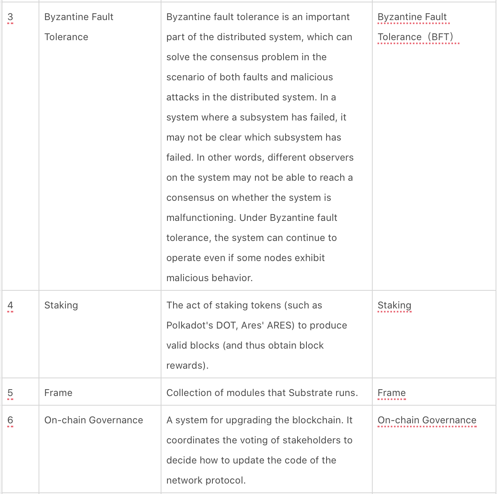
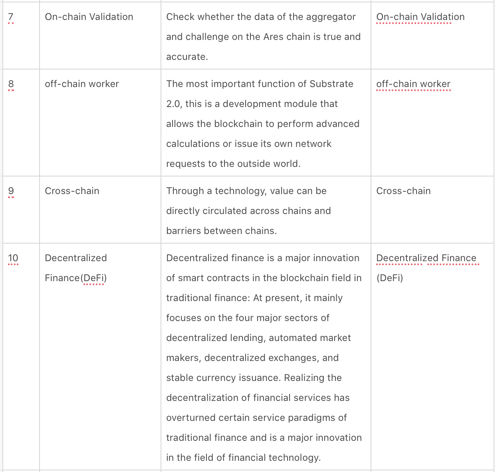

##  Network and Token

Project name: God of War Protocol/God of War

Testnet:Gladios

Mainnet:Thrace

Kusama Advance Network:Mars

Ethereum network staking pool:Trojan

BSC network staking pool:iliad

Mainnet token:ARES

Mars token:AMAS

### Glossary

