### Method A: Log in Polkadot{.Js} Wallet
1. Enter the page https://polkadot.js.org/extension/ and open Polkadot{.Js} wallet; add an extension to Chrome or Firefox.

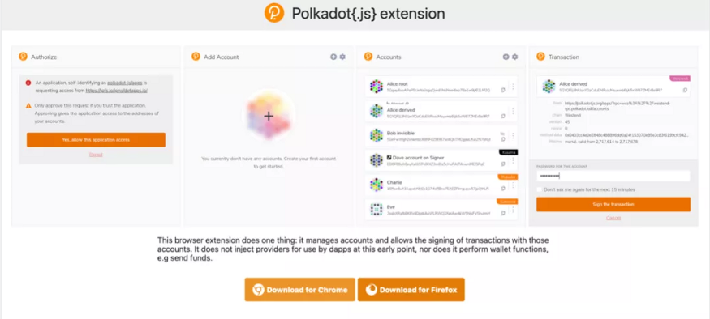

2. After adding Polkadot{.Js} extention program, click [ + ], to add your account.

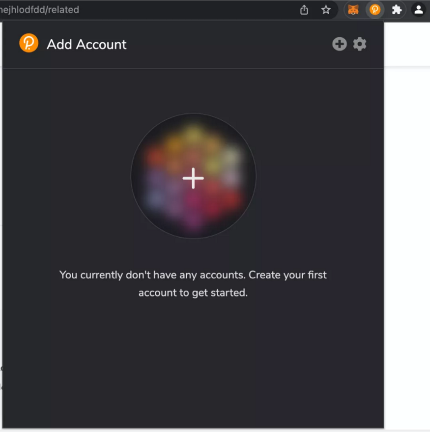

3. Select [ Allow use on any chain ], type your account name and password. Click [ Add the account with the generated seed ]

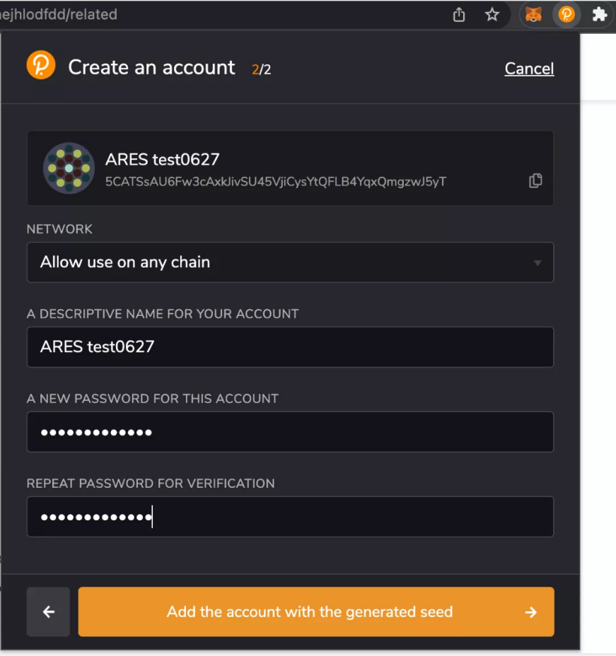

4. Please be noted to choose [ Allow use on any chain ], to ensure your operation will be proceeding normally in Gladios.

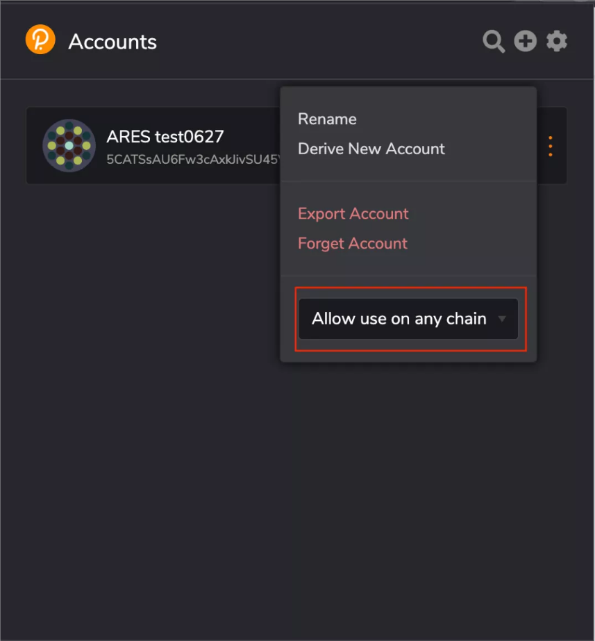

5. Open the test network Gladios: http://js.aresprotocol.io/?rpc=wss%3A%2F%2Fgladios.aresprotocol.io#/explorer
allow Polkadot{.Js} to access.

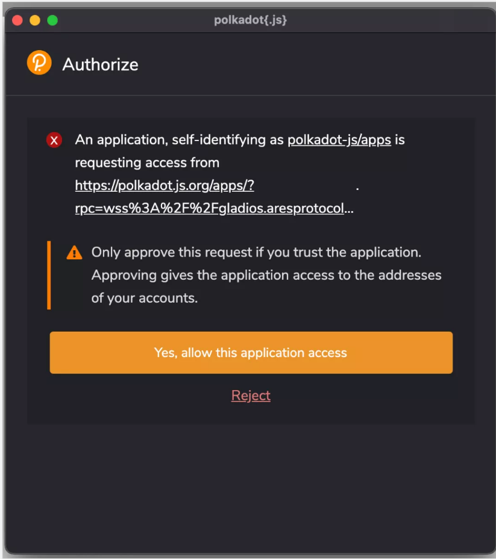

6. Click [ accounts ] and choose [ accounts ] in the drop-down list.

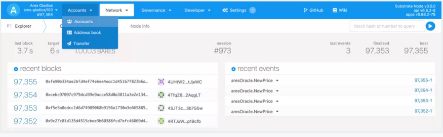

7. In [ my accounts ], your account in Polkadot{.Js} will be automatically recognised.

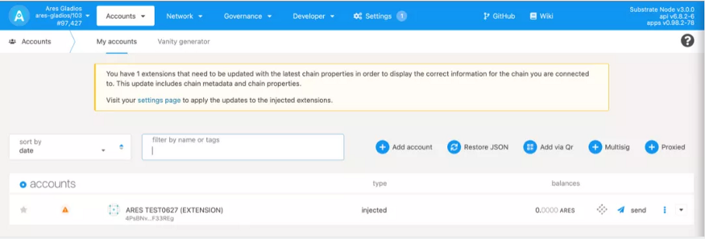

### Method B: Create Ares Account

Open the following page https://js.aresprotocol.io/?rpc=wss%3A%2F%2Fgladios.aresprotocol.io#/explorer/

Step 1  

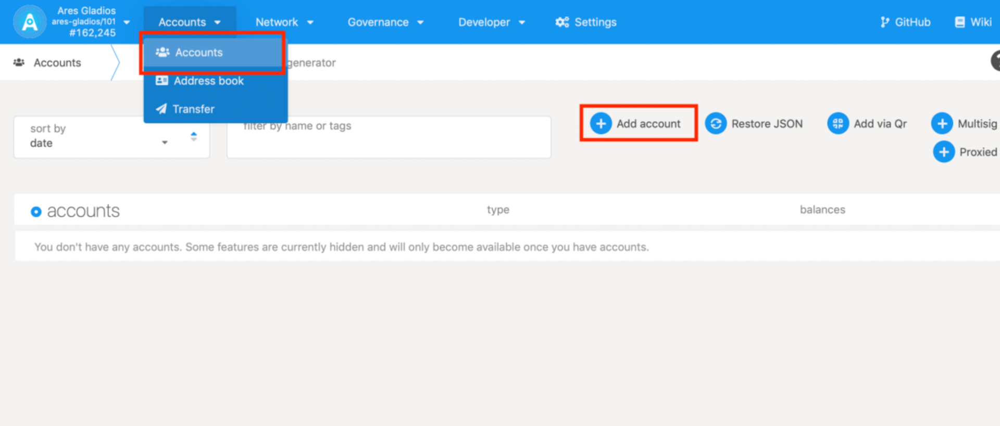

Enter Ares APPS,  click "Accounts" in the navagation bar at the top of the window, click "Add account", as shown above.

Step 2

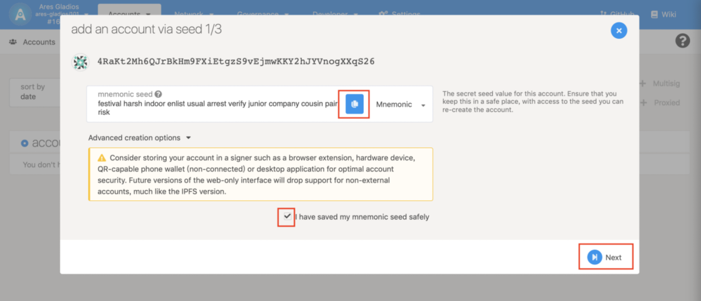

The account's mnemonic seed value. Make sure save mnemonic seed in a safe place and check "I jave saved my mnimonic see dafely".

Step 3

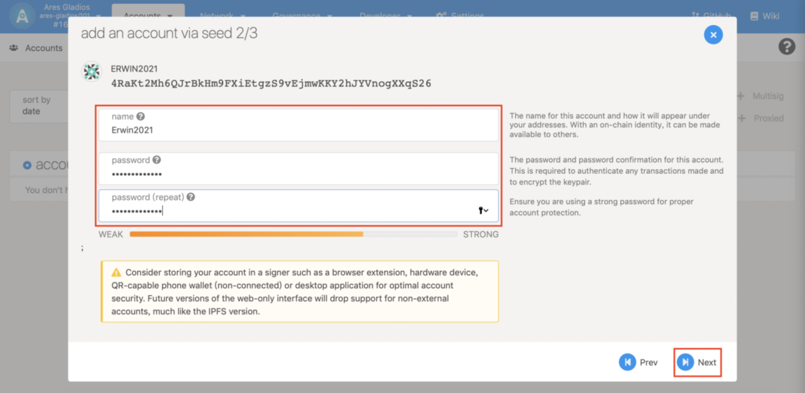

Enter your account name and password, then click "Next".

Step 4
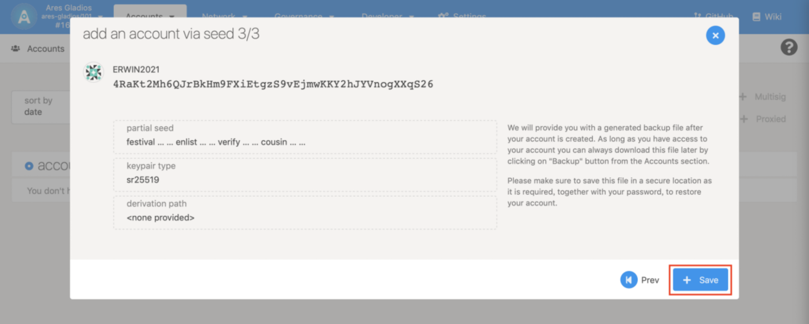

Click "Save", this account will backup on your device bu default. Please see you backup file.
