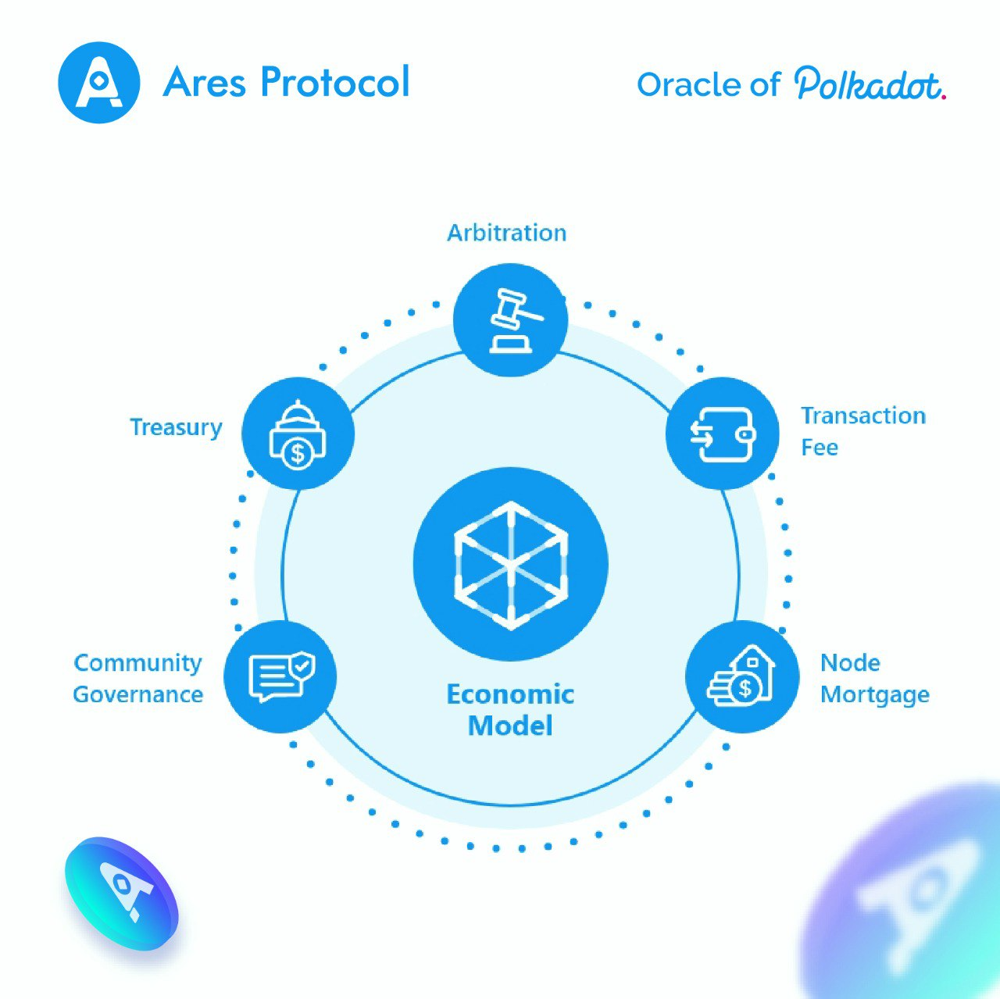

### Economic Model

We will issue ARES tokens to incentivize all participants in the system and ensure the growth and development of the ecosystem through community governance. The original circulation is 1 billion pieces.

**Node Mortgage**

Any third party can access the Ares network as a node by mortgage a small amount of ARES tokens, providing oracle services, and enjoying mining rewards. The total amount of initial tokens in the mining pool accounts for 20%. Every year, 10% of the remaining mining pools are mined and distributed to the nodes. The mining rewards decrease year by year but never finish mining.

**Transaction Fee**

For each oracle request, a processing fee (gas) needs to be paid to the node. 80% of them belong to the aggregators and 20% are handed up to the treasury.
The ARES token will be the first supported fee token, and the holder of the token also has the right to vote to determine which other tokens can also be used as the fee token supported in the Ares network, such as stable coins.

**Arbitration**

The aggregator or challenger is punished through the challenger dispute, and a part of the fee will be rewarded to the reputation committee.

**Treasury**

In the Finance Bureau of the Ares network, treasury funds come from a part of the transaction fee, the punishment of malicious nodes, and inflation caused by pledges. Treasury funds are used to reward challengers, make up for the loss of data demanders, and ecological construction.
Treasury funds can be used by initiating proposals. Any holder of the Ares network can participate in the referendum, and the Ares network can develop healthily through a democratic governance model.

**Community Governance**

Anyone holding the ARES token has the right to govern and can vote for protocol upgrades and reputation committee elections. The Reputation Committee ensures the security of the Area network by incentivizing challengers and punishing malicious nodes.

## Recap
Ares is a decentralized oracle solution, which realizes the on-chain and on-chain verification of oracle data. It provides secure and reliable data services for the interconnection and digital economy in the Web3.0 era. Under this agreement, all participants jointly maintain the security of the entire system for their own benefit. We gave a general outline of this architecture, including the various participants in the ecosystem, their economic incentive models and the operations they need to do. We will iterate in the future and provide a more detailed yellow paper to describe the design details, please continue to pay attention.
