## General Outlook

Welcome to the Ares Iliad stake mining on BSC main network. 

http://iliad.aresprotocol.io/

#### Stake Mining Scheme(Current Model)

1.The reward ratio declines linearly as the amount of Staking increases. For example: when the amount of staking reaches 10,000, APY is 7,604%; When the amount of staking reaches 100,000, APY is 760%; When the amount of staking reaches 1 million, the APY is 76%.

2.Staked tokens and rewards are available to withdraw at any time.

3.Staking has two steps, first, send Approve to allow the transaction and click Staking to launch operation.

4.Withdrawal includes Unstake Tokens, Claim Rewards, Claim and Unstake; they all need on-chain transactions.

5.All processes above require a BNB gas fee; while you are operating, you shall guarantee a certain amount of transaction fee.

#### Stake Mining Scheme(Regular Mode)
1.It has three staking terms; they are 60days, 120days, 180days, APY is 35%, 40%, and 45%, respectively.

2.Staking rewards are available for withdrawal at any time; staked tokens are available for withdrawal after the ending of the regular term.

3.Same as 3 of the current mode.

4.Same as 4 of the current mode.

5.Same as 5 of the current mode.

### Operating Steps

Stakers on Trojan might quickly get familiar with the Iliad stake mining. This tutorial will guide you to know more about the concepts of Ares staking and operations on the Ares Iliad staking page. Worth mentioning is that this tutorial is available for both current and regular stake mining. Both modes are almost the same except for the claiming and unstake process.

**Notification: this page requires Metamask authorized transaction. If you are unsure how to set the Metamask, you could research some articles to acquire relevant information.**

1.Log into your Metamask, and change the network into BSC MAINNET.  
Method A: change the website into BSC MAINNET on Metamask.

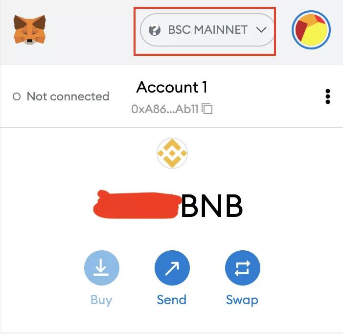

If you cannot find the MAINNET option, you may use Method B.

Method B: Open the BscScan, click the fox image “Add BSC Network”, after the page hopped, click the shown button “Switch network”.

ARES BscScan：https://bscscan.com/address/0xf9752A6E8A5E5f5e6EB3aB4e7d8492460fb319f0 

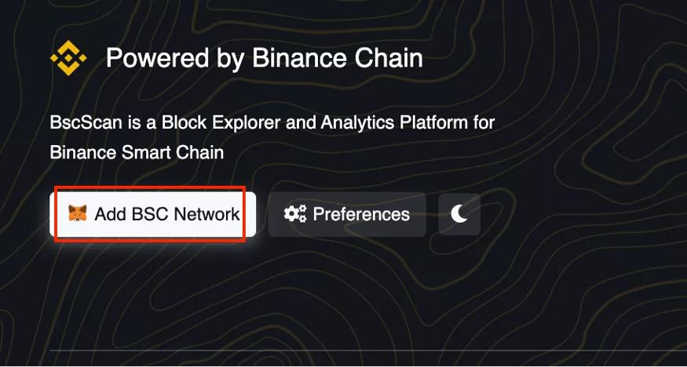

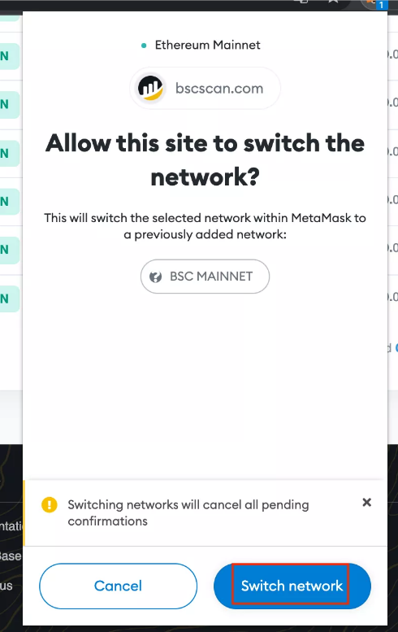

2.Open the BscScan, add the Ares token into Metamask.

ARES BSC treaty address：0xf9752A6E8A5E5f5e6EB3aB4e7d8492460fb319f0
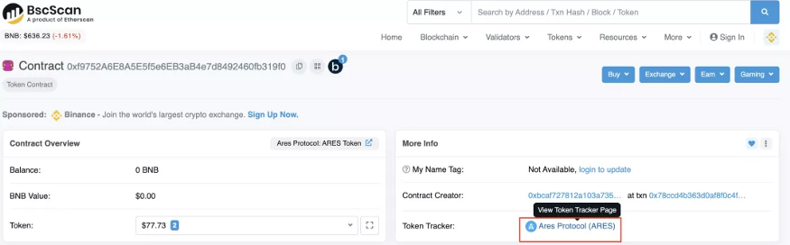

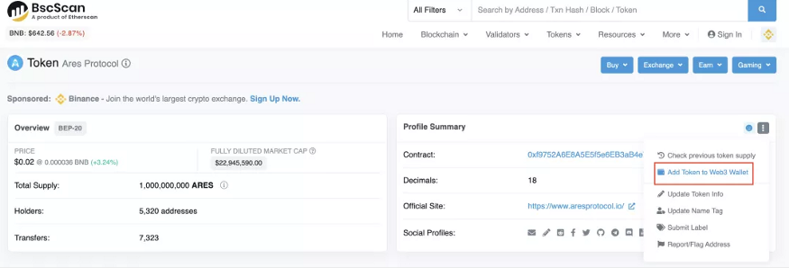

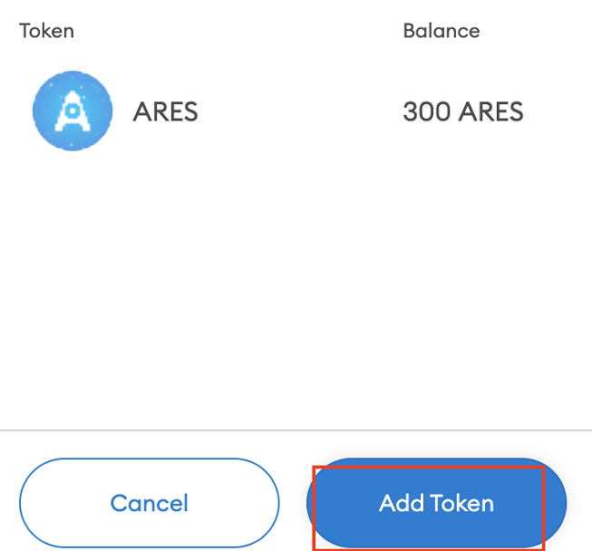

3. Connect your wallet
Open the staking page:
http://iliad.aresprotocol.io/ 

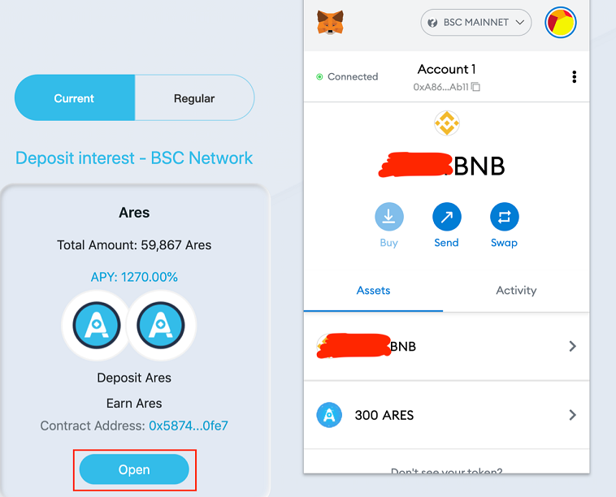

4.Main Page  
4.1 “Open” current/regular staking page, click the “Stake Tokens” button.
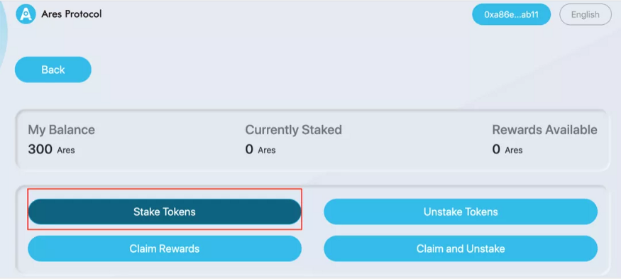

4.2 If it’s your first time entering the Iliad, you should press “approve” to confirm your operation.
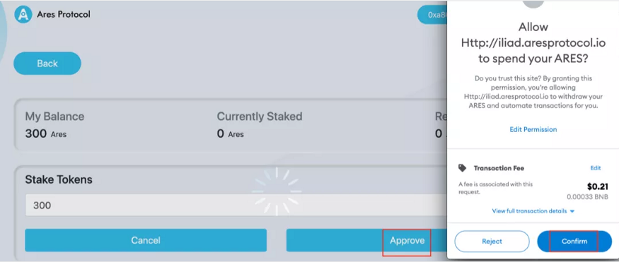

4.3 After the approval status of your address is successful, you can press the "Stake Tokens" button and enter the number of tokens for staking.
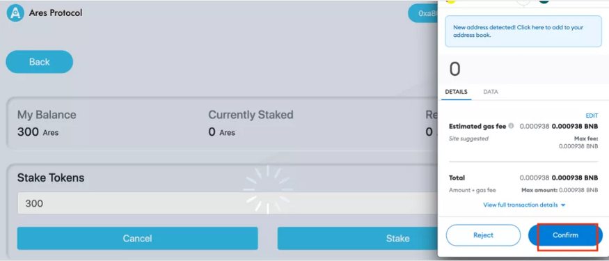

4.4 Unstake Tokens (current mode)

You could click “Unstake Tokens” to withdraw your tokens. Input your token amounts and click the “Unstake” button.
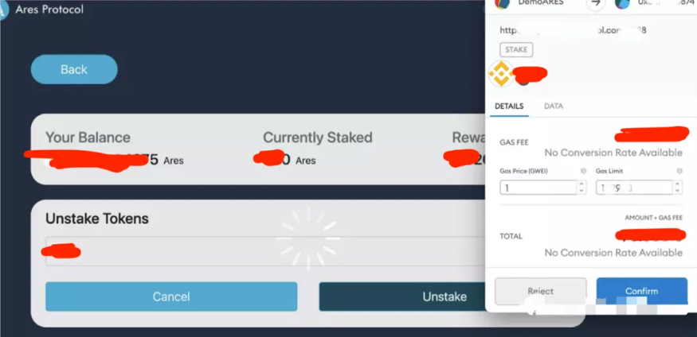

4.5 Claim Rewards

Click” Claim Rewards”, check the Gas fee, and click “ confirm” to claim rewards.
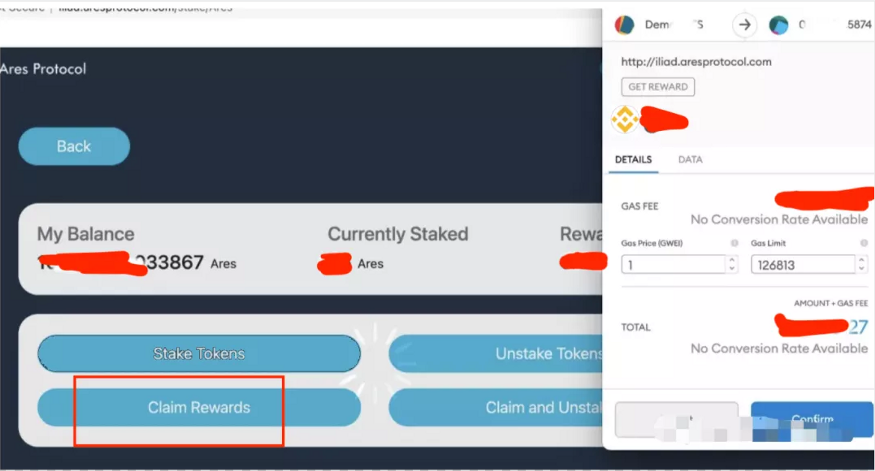

4.6.1 Claim and Unstake(current mode) Click "Claim and Unstake", you can cancel all tokens and receive all rewards with one click.

4.6.2 Claim and Unstake(regular mode) If it is a regular product purchased, the button is gray, and you need to wait for the specified time before withdrawing the reward.

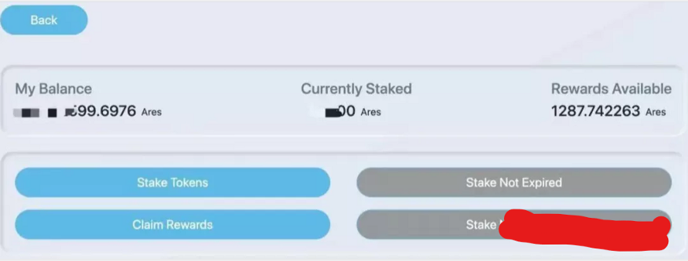

### FAQ
1. What’s the difference between Staking on Trojan or Iliad?

The trojan is based on the Ethereum Mainnet, Iliad is based on the BSC Mainnet.
The trojan gas fee needs ETH, Iliad gas fee needs BNB.
Comparably, the gas fee for staking is lower in Iliad.

2. Is it possible to refer this BSC address to Exchange to participate in staking?

No, it should be a wallet address; so far, Exchanges only supports ARES on Ethereum.

3. Well, how I can get the ARES for staking on Iliad?

Airdrop tokens already distributed on your BSC wallet address.
You could trade on PancakeSwap.

PancakeSwap transaction address：

https://pancakeswap.finance/swap?inputCurrency=0xf9752a6e8a5e5f5e6eb3ab4e7d8492460fb319f0

You could swap the ARES on the ETH to the official address to exchange. Please refer to Question 4. for details.

4. Can I transfer the ARES on ETH to BSC?

It needs a cross-chain bridge. So far, the cross-chain bridge hasn’t been launched; you might swap to the official address to exchange.

ETH official address: 0xbcAf727812A103a7350554B814Afa940B9f8b87D

5. What is the volume of ARES on ETH and BSC?

ARES’ volume is 1 billion.
Currently, the APY of current staking on BSC has reached 1270.00% maximum; We sincerely welcome you to make profit from staking.
