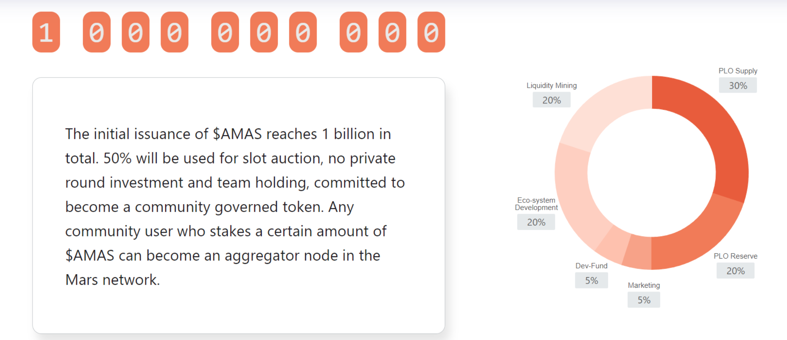
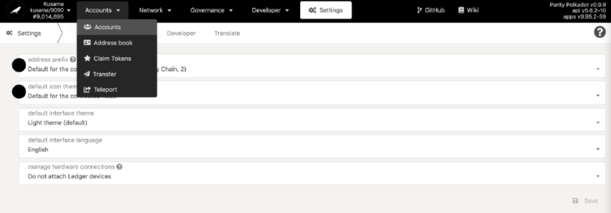
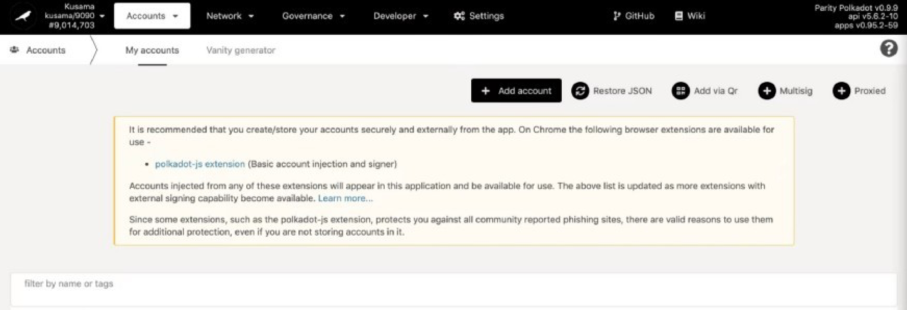
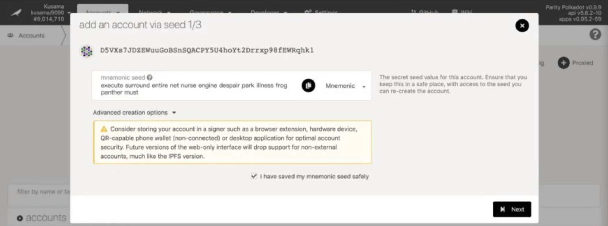
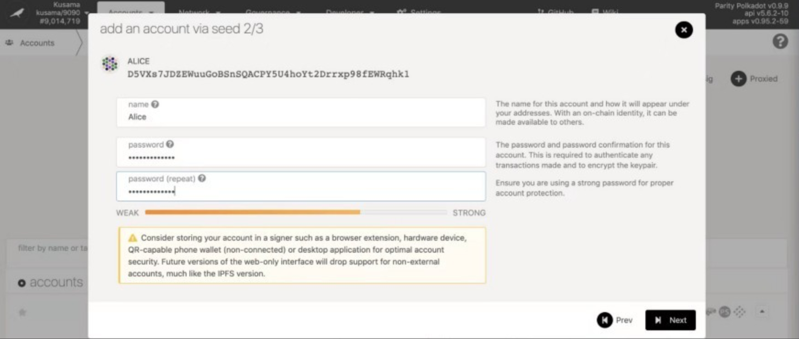
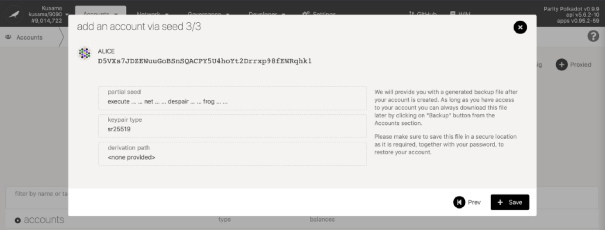
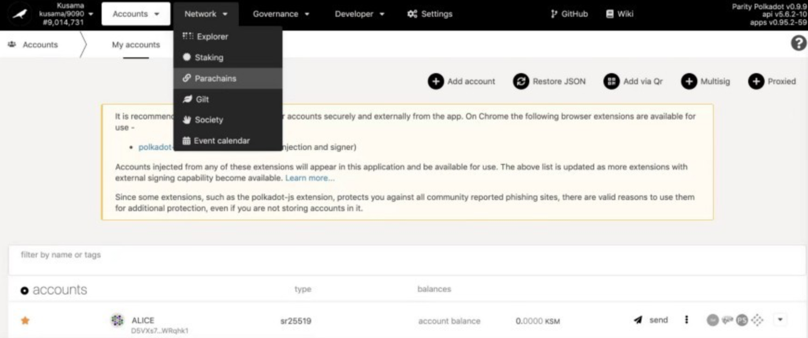
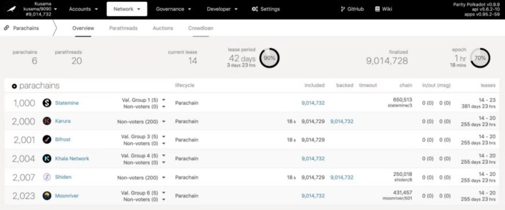
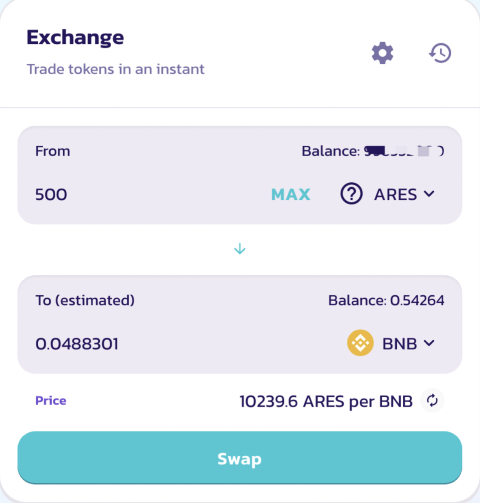

### Crowdloan
Ares Protocol continues to participate in the Kusama ****Parachain Slot Auction, currently officially launched crowd-loan for Kusama.

Mars is a canary network built by Ares Protocol on Kusama. It will conduct some contract call tests for asset prices. If tested in a real environment, it will be deployed on the Ares Protocol mainnet.

After a successful auction of the Kusama slot, Ares Protocol will provide Kusama with native oracle support, support the Ink contract ecology, and bring better oracle services to Defi developers.

**Mars token $AMAS**

Mars token ($AMAS) will be used for contract call tests for some asset prices, in the meantime, it will be used for community governance and other functions.

The initial issuance of $AMAS reaches 1 billion in total. 50% will be used for slot auction, no private round investment and team holding, committed to becoming a community governed token. Any community user who takes a certain amount of $AMAS can become an aggregator node in the Mars network.

**$AMAS token distribution**

### Crowd-loan operating process

**Step 1**

Click here to enter the slot auction page

https://polkadot.js.org/apps/#/explorer

**Step 2**

Click【account】and then click 【add account】remember keywords, get KSM account. Transfer information of exchanges and wallets into this ksm account.

**Step 3**

Select【main net】 ，select【parachains】 from the drop-down list ，and click【Crowdloan】.

**Step 4**

Select【2008 Mars】 ，click【Contribute】。

**Step 5**

Select the account which you want to join，and put in the amount in the window, and then select 【Contribute】。

**Step 6**

Sign and submit in the end.

### Auction strategy

Mars is currently running a Crowdloan campaign at polkadot.js.org. The serial number is “2008” and slots of 8 cycles will be auctioned, i.e., the leasing period is 6 weeks *8=48 weeks.

The current rules are:

1. Support 1 KSM for 1000 AMAS;

2. When the total amount of KSM staking by Mars crowd-loan exceeds 50,000, users will receive 1200 AMAS for each $1 KSM they support, i.e., the fixed ratio is adjusted to KSM: AMAS = 1:1200.

Up to 300,000,000 AMAS will be distributed to KSM contributors. After the successful auction, the rewards will be distributed linearly until the ending of the crowd-loan. In the future, AMAS might be listed in the exchanges according to its popularity or converted into ARES in a certain proportion. Mars will become a canary network with economic value.

#### Crowdloan Airdrop Receiving Procedure

**Step1**

Enter the Mars official page:：https://aresprotocol.io/mars，Click 【Crowdloan Drop】;

**Step 2**

Click【Connect Polkadot.js.extension】to connect wallet;

**Step 3**

If the screen displays「Sorry, you are not on the list」that means you are not entitled to this airdrop, you could be entitled later by contributing our slot auction;

**Step 4**

If the screen shows「Thanks for your contribution to the KSM slot」, then the KSM data you contributed will be manifested with relevant ARES airdrop reward. Put in your ETH address，click【Submit】，wait in patience ARES, you will get your ARES tokens;

**Step 5**

The airdrop will be distributed in BSC, please enter the ARES page in Pankcake;

https://pancakeswap.finance/swap?inputCurrency=0xf9752a6e8a5e5f5e6eb3ab4e7d8492460fb319f0

**Step 6**

Connect wallet, put in ARES amount then you could extract as related BNB, USDT assets, click 【SWAP】to complete your request.

KSM contributed by contributors for Mars on the KUSAMA slot auction has been returned to the supporters. Looking forward to contributing to our next slot auction.