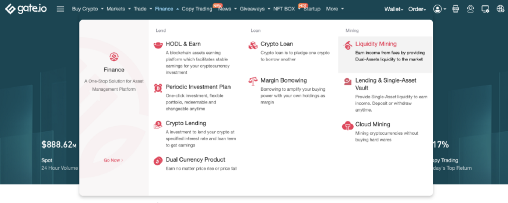
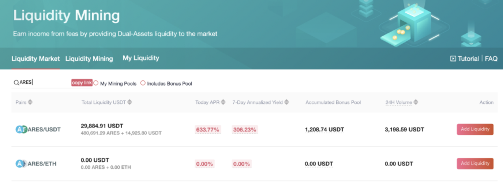
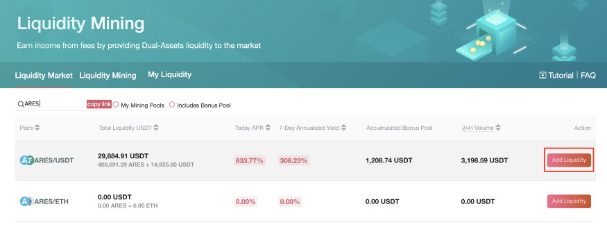
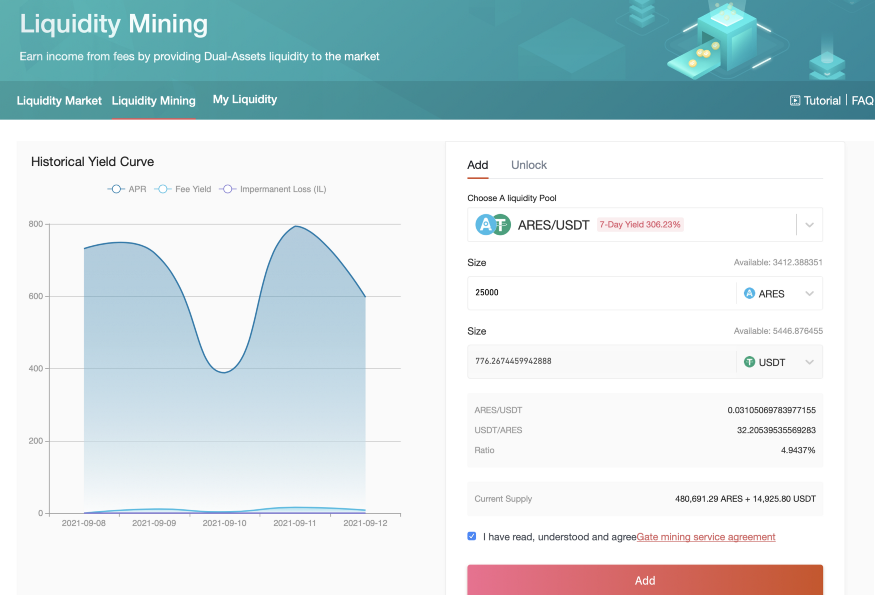
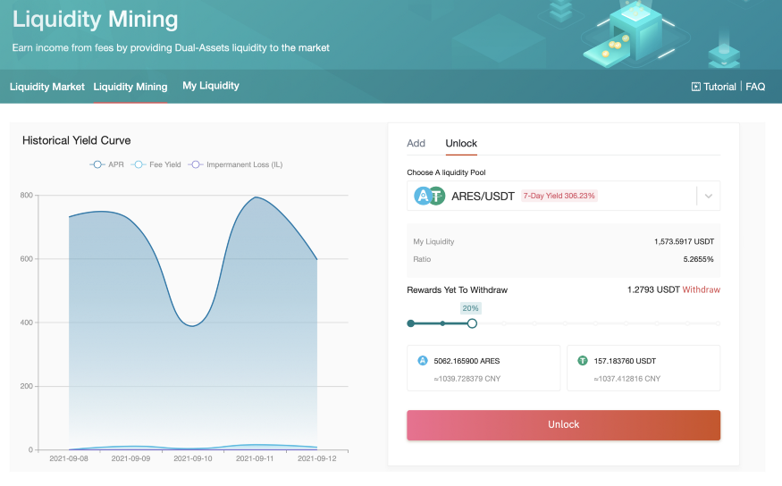
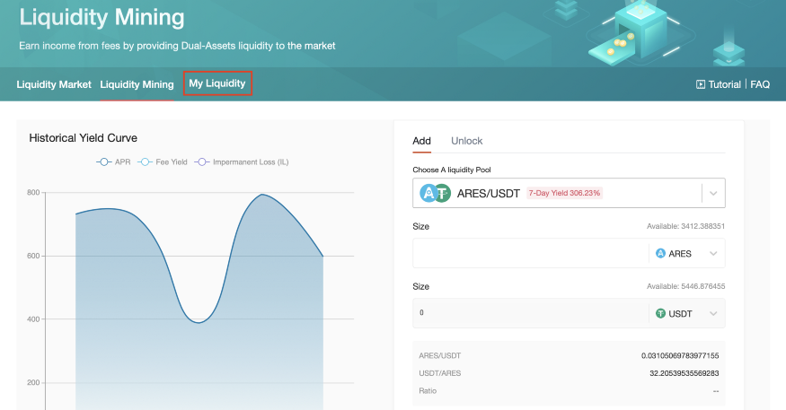
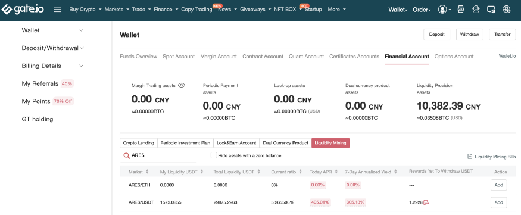

### Liquidity mining
gate.io listed Ares into a new version of a liquidity mining pool. Ares has officially launched the USDT, ETH trading pool while starting a new version of rewards for liquidity mining pools(AMM; Automated Market Maker). Up till now, the APR reached 894.88%!

Welcome to profit from Ares, https://www.gate.tv/cn/liquidity/ares

#### The new version of the liquidity mining pool of gate.io

If the liquidity of the project is insufficient, there will be limited liquidity, the depth of the gap is not conducive to the user for large transactions or the user need to pay high price of the gap slip point (the disparity between the actual transaction price and the price in the gap).

Gate. io’s inclusion of ARES in the new liquidity pool will bring more liquidity to ARES. It lowers the barriers to user participation and allows for safer and more efficient liquidity mining while lowering the Gas fee. At the same time, Gate.io also officially launched its centralized Automated Market Maker (AMM) service, which has the same liquidity advantages as Uniswap. Ares Protocol will also carry out liquidity mining in Uniswap later.

Liquidity mining is a method of acquiring more cryptocurrencies by staking them. Users can earn market-making dividends by adding liquidity to the market. By adding liquidity, the capital is injected into the capital pool, and the fee income from the Automated Market Maker of the capital pool will be allocated to the liquidity provider according to the proportion of the capital pool. Liquidity can be accessed in real-time without charging any fees.

Through the Automated Market Maker mechanism, liquidity providers (LP) can gain market fee benefits by providing liquidity to the market, while Taker contributes fees to liquidity providers in exchange for lower trading slip points. Through this mechanism, the market demand of both parties is well matched, so that LP and Taker take what they need.

### Market and award rules

1. Taker and Maker use a fixed 0.3% fee, no point card deductible (temporarily consistent with Uniswap, will be adjusted according to the needs of both market competitors)

2. A fixed percentage (for example 50%) of the market’s fee income will automatically be purchased into $GT in the open market and invested into the mobile AMM Reward Pool.

3. Anyone can become a liquidity provider (LP) by providing liquidity and receiving a liquidity pool fee reward and a $GT reward for putting into the liquidity bonus pool.

4. Liquidity providers provide liquidity to the market, but they need to bear impermanent losses (capital losses caused by price discrepancy from digital assets. For example: when the market price doubles, the impermanent loss is about 7%, and the loss disappears when the market price falls back to the origin.)

5. Liquidity providers can claim or withdraw from the bonus pool at any time

#### Reward
Share 100% transaction fee to LP（liquidity provider）.
Participants have the opportunity to earn additional income from the time-limited bonus pool. 

### Liquidity mining procedure
1.Log in gate account. Click gate.io on the first page, select “ Finance ”, and select “Liquidity Mining”.  

2.Search Ares, trading pairs of Ares, USDT, ETH will be immediately shown. Or directly search the URL link https://www.gate.tv/cn/liquidity/ares to access the address.  

3.Select an appropriate trade pair and click “Add Liquidity”.    

4.On the table of “Add Liquidity”, type the number of varieties of the coins and click the consent treaty to click “Add”. Saved liquidity assets will be stored into the AMM account from current account.  

5.How do withdraw? Click the Unlock, on the table of “Rewards Yet To Withdraw” , drag the slide to moderate the percentage to withdraw. The withdrawn liquidity will be converted into related coins to be returned to original account.  

6.How to check the record of liquidity mining and profit? Click “My Liquidity”  

7.Search ARES, you will be able to live check your current profit.  

