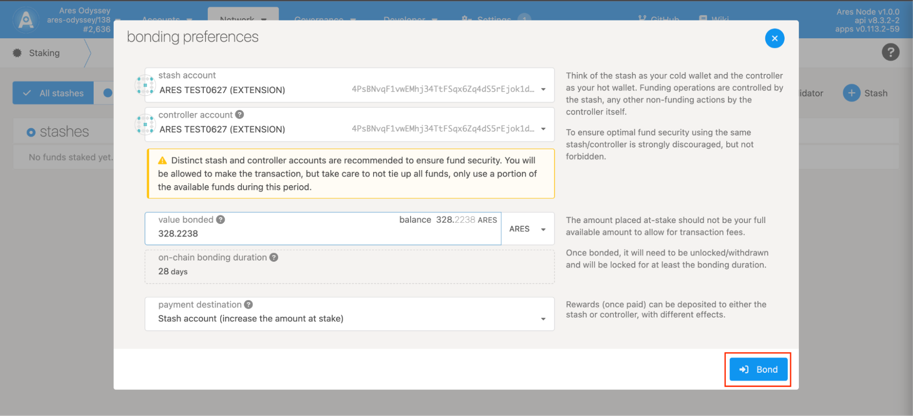

## 质押

第一步：

如上图：进入Staking页面，点击 “Accounts” 后点击Stash按钮

第二步：

选择需要质押的账户(stash account)以及对应的控制账户(controller account)。stash跟controller可以是同一个账户，但是实际操作中强烈不建议这样做。根据需求填入需要质押的金额(value bonded)，质押金额从质押的账户(stash account)上扣除。
* stash账户可以想象成您的冷钱包，资金的操作都是由stash账户来控制。
* controller账户，其它非资金操作都由controller来做(如：设置sessionKeys、设置佣金、参与投票、解除质押等)
* 质押金额，不要把所有可用余额都用来质押，需留部分来做交易的手续费

填写完以上信息后，点击Bond按钮完成质押操作。
