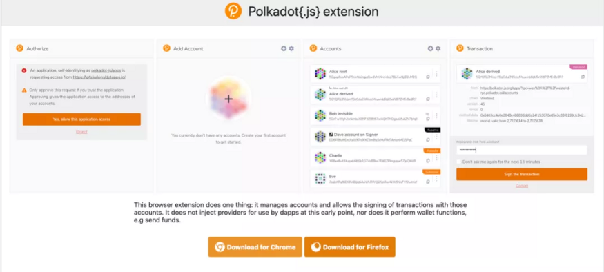
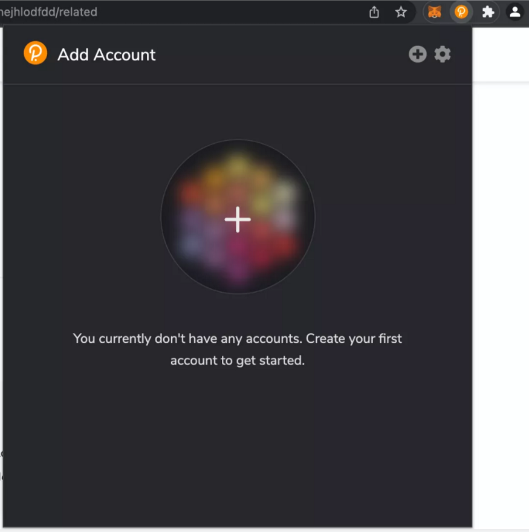
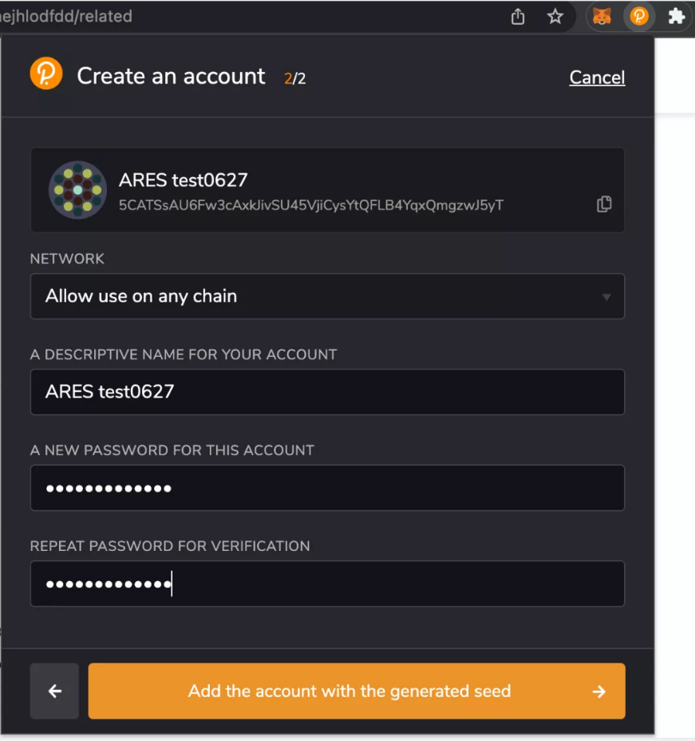
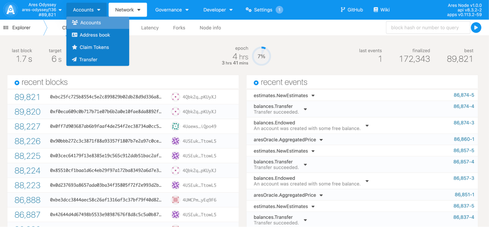
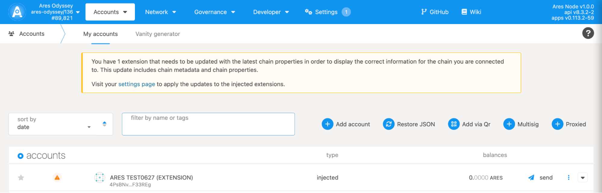
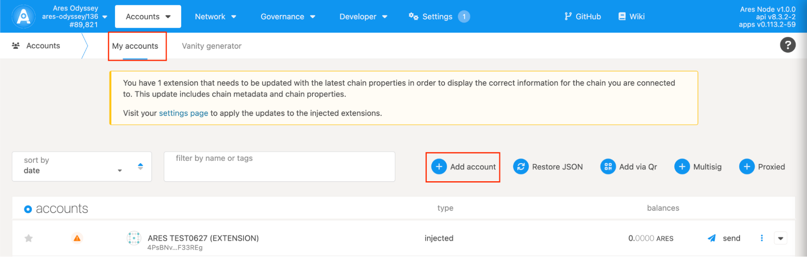
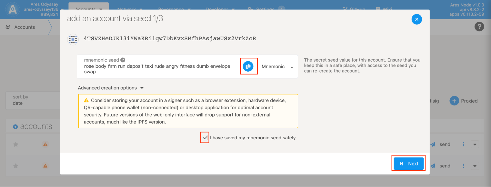
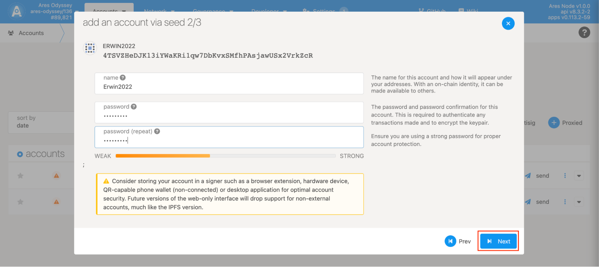
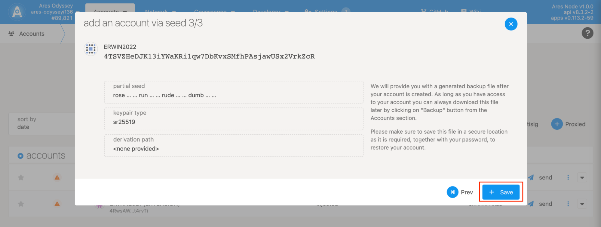

## Method A: Log in Polkadot{.Js} Wallet
1. Enter the page https://polkadot.js.org/extension/ and open Polkadot{.Js} wallet; add an extension to Chrome or Firefox.
   
2. After adding Polkadot{.Js} extension program, click [ + ], to add your account.
   
3. Select [ Allow use on any chain ], type your account name and password. Click [ Add the account with the generated seed ]
   
4. Open mainnet prep network Odyssey: https://js.aresprotocol.io/?rpc=wss%3A%2F%2Fodyssey.aresprotocol.io#/accounts allow Polkadot{.Js} to access.

5. Click [ accounts ] and choose [ accounts ] in the drop-down list.

   
6.In [ my accounts ], your account in Polkadot{.Js} will be automatically recognised.
   

## Method B: Create Ares Account

Open the following page https://js.aresprotocol.io/?rpc=wss%3A%2F%2Fodyssey.aresprotocol.io#/accounts

1. Step 1
   
Enter Ares APPS, click "Accounts" in the navigation bar at the top of the window, click "Add account", as shown above.

2. Step 2
   
The account's mnemonic seed value. Make sure to save mnemonic seed in a safe place and check "I have saved my mnemonic seed safely".

3. Step 3
   
Enter your account name and password, then click "Next".

4. Step 4
   
Click "Save", this account will backup on your device by default. Please see your backup file.
