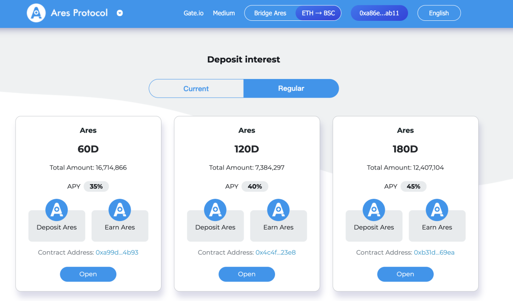
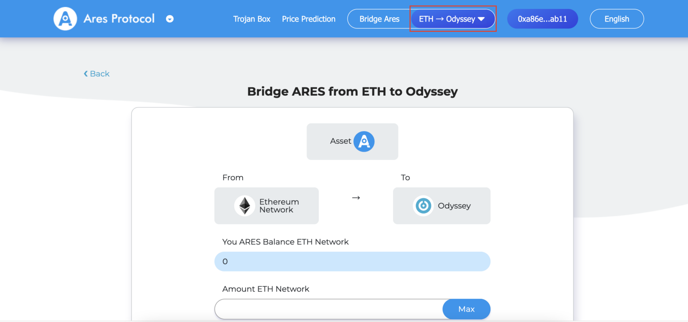
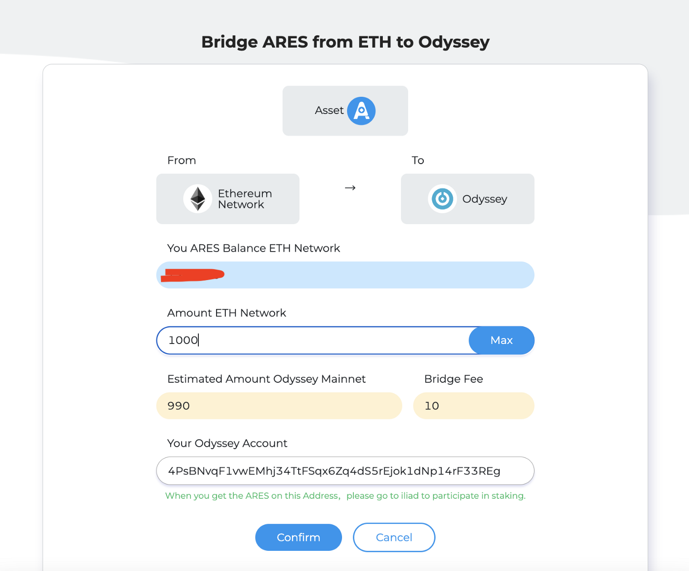
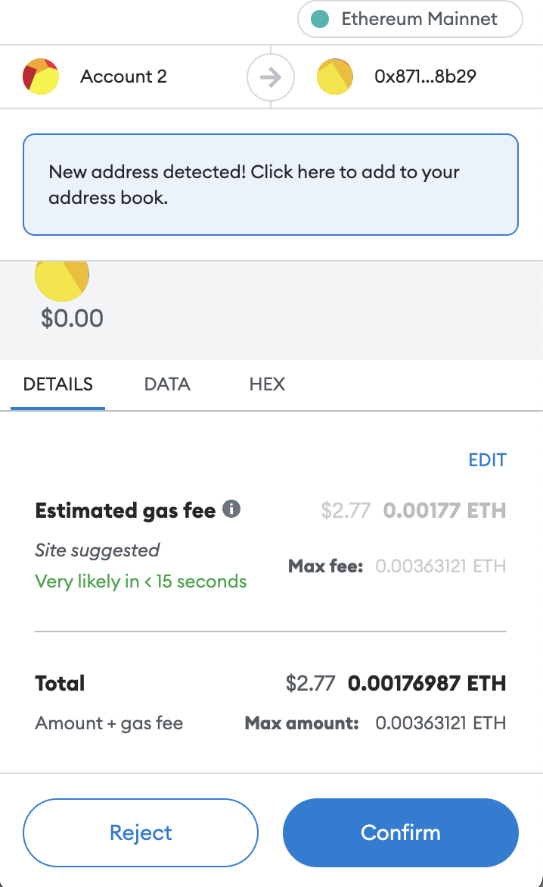
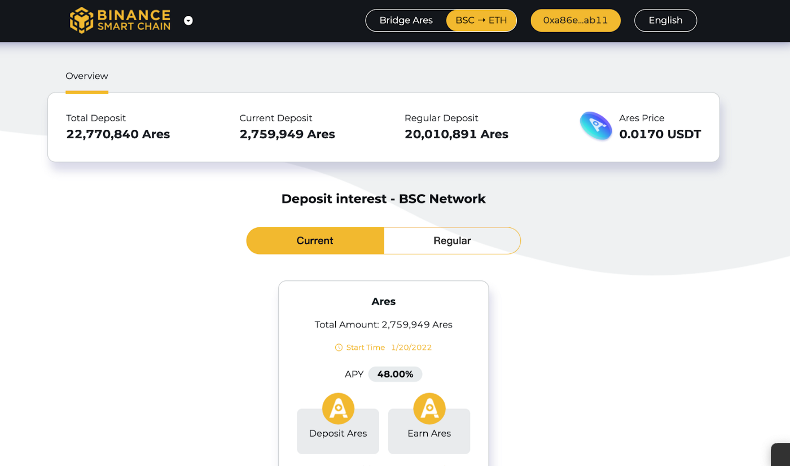
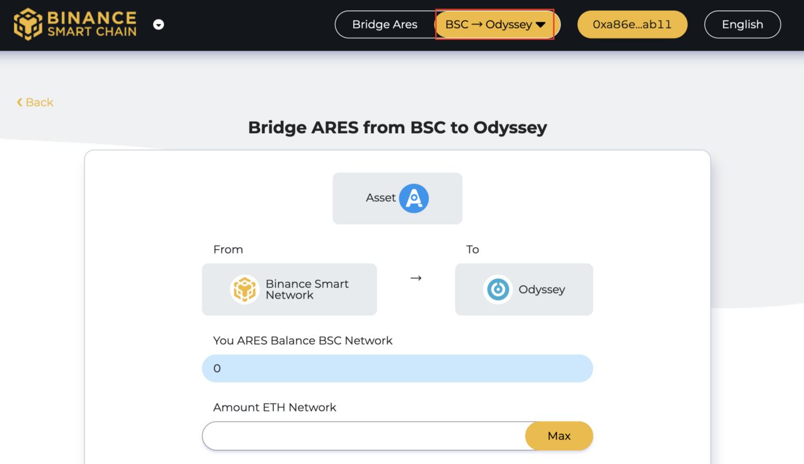
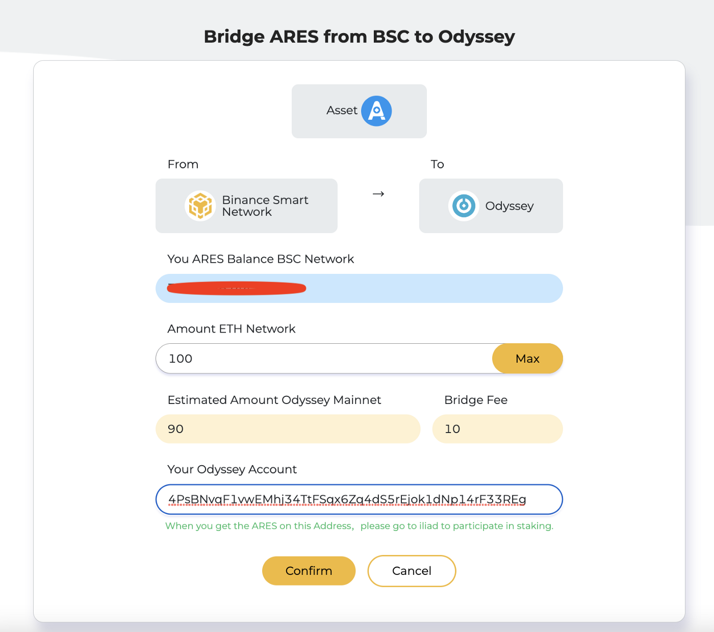
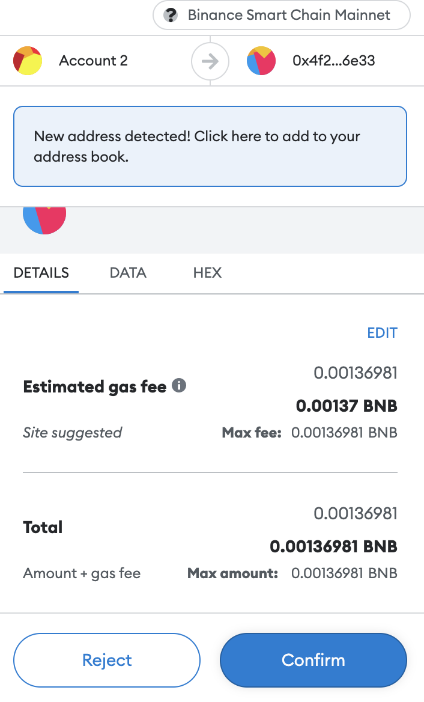

Ares Odyssey is a real economic system where participants can map 1:1 ARES-ERC20 or ARES-BEP20 assets into Odyssey for staking, nominating or experiencing on-chain data request functionality. The proceeds earned therein will remain in the Odyssey network and can be withdrawn by users via the Odyssey — ETH or Odyssey — BSC cross-chain bridges, mapped 1:1 to ARES-ERC20 or ARES-BEP20 assets.

## Operation steps

**ETH — Odyssey Network Cross-Chain Bridge**

1. Connect your wallet and open the stake screen: [http://trojan.aresprotocol.io/](http://trojan.aresprotocol.io/)

2. Click on “Ares Bridge” to open the ARES asset cross-chain bridge from the ETH chain to the Odyssey network.

3. Fill in the asset amount in the Asset Cross-Chain Bridge function interface, the system will automatically identify the ARES balance of your wallet. Fill in the amount you want to migrate to the Odyssey network. Confirm that the “ARES amount to be received on the Odyssey network”, the “cross-chain bridge fee” and your Odyssey account number are accurate. If they are correct, click “Confirm”.

4. The first time you use the cross-chain bridge, you need to approve it first. After completing the authorization, confirm the cross-chain transaction to see the Gas fee and click “Confirm”.

5. Complete the transaction

Your request has been successful, please wait patiently for the assets to be credited. You can open AresScan or polkadot.js to check the balance of the corresponding Odyssey account.

AresScan: [https://aresscan.aresprotocol.io/odyssey](https://aresscan.aresprotocol.io/odyssey)

polkadot.js: [https://js.aresprotocol.io/?rpc=wss%3A%2F%2Fodyssey.aresprotocol.io#/accounts](https://js.aresprotocol.io/?rpc=wss%3A%2F%2Fodyssey.aresprotocol.io#/accounts)

⚠️ Cross-chain transactions require some review time and are expected to arrive within 48 hours. If it still hasn’t arrived after 48 hours, please contact Ares Protocol Community Manager or official email address at info@aresprotocol.io. Staff will handle it for you in time.

**BSC — Odyssey Network Cross-Chain Bridge**

1. Connect your wallet

Open the stake interface: [http://iliad.aresprotocol.io/](http://iliad.aresprotocol.io/)

2. Click on “Ares Bridge”

Open the ARES asset cross-chain bridge from BSC chain to Odyssey network.

3. Fill in the asset amount

The system will automatically recognize the ARES balance of your wallet in the Asset Bridge interface. Fill in the amount you want to migrate on Odyssey network. Confirm that the “Amount of ARES to be received on Odyssey network”, “Cross-chain bridge fee” and your Odyssey account number are accurate. If they are correct, click “Confirm”.

4. Confirm the transaction

Check the Gas fee and click “Confirm”.

5. Complete the transaction

Your request has been successful, please wait patiently for your assets to arrive. You can open AresScan or polkadot.js to check the balance of the corresponding Odyssey account.

AresScan: [https://aresscan.aresprotocol.io/odyssey](https://aresscan.aresprotocol.io/odyssey)

polkadot.js: [https://js.aresprotocol.io/?rpc=wss%3A%2F%2Fodyssey.aresprotocol.io#/accounts](https://js.aresprotocol.io/?rpc=wss%3A%2F%2Fodyssey.aresprotocol.io#/accounts)

⚠️ Cross-chain transactions require some review time and are expected to arrive within 48 hours. If it still hasn’t arrived after 48 hours, please contact Ares Protocol Community Manager or official email address at info@aresprotocol.io. Staff will handle it for you in time.