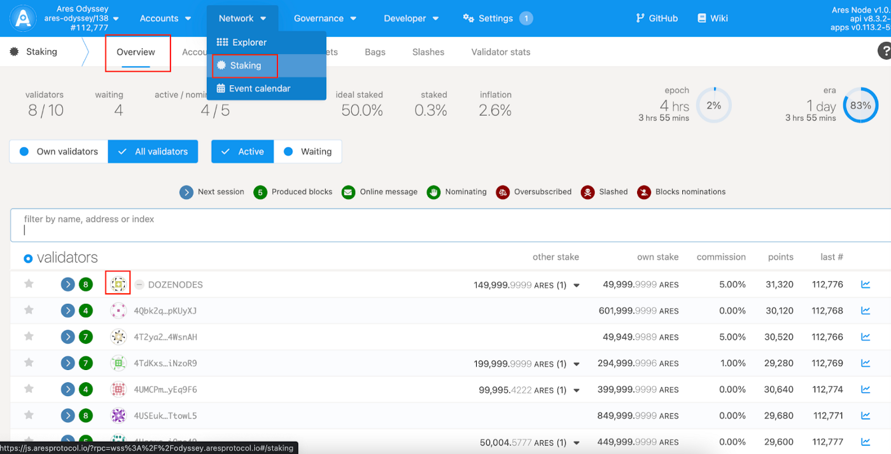
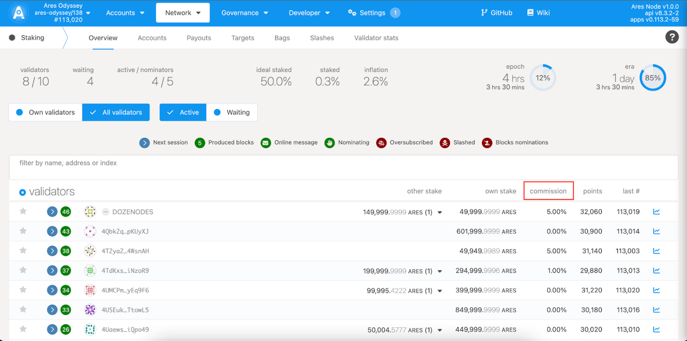
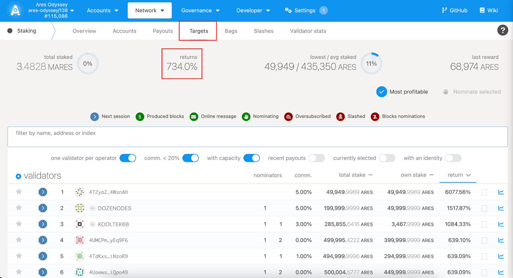
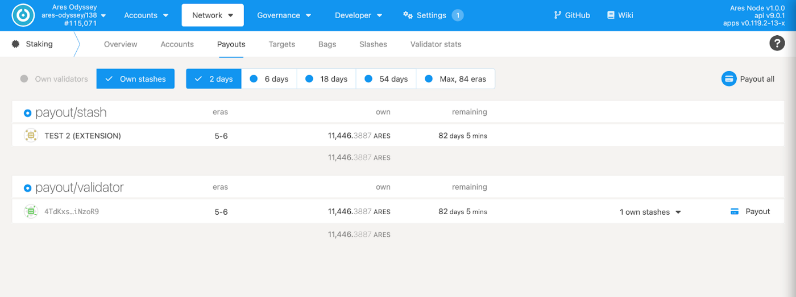
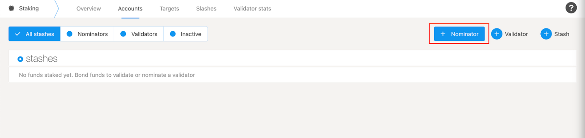
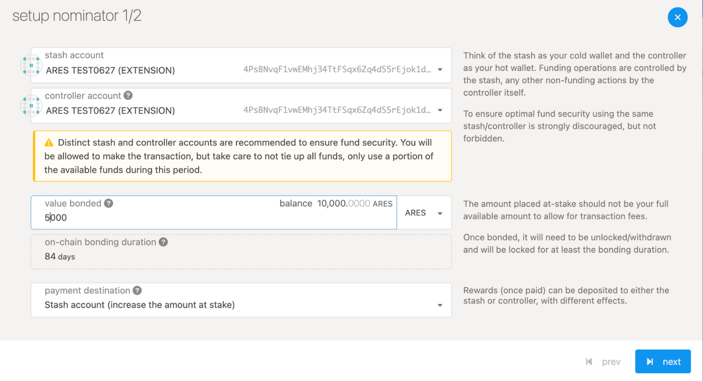
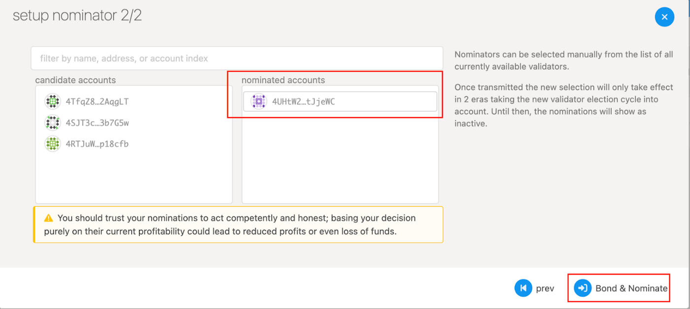
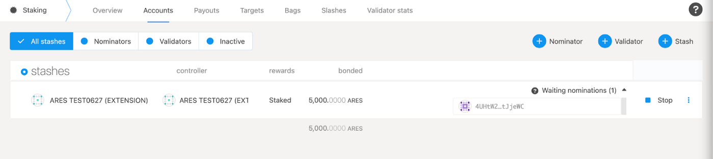
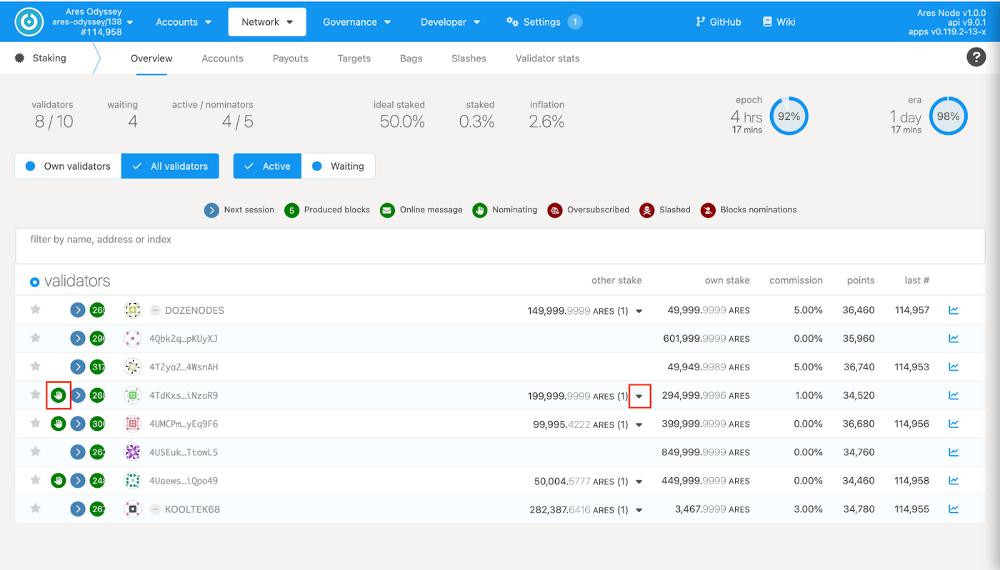

## **Select the node you want to nominate**

After entering Odyssey APP, click “Network” and select the “Staking” screen. In “Staking Overview,” you will see a list of running Ares nodes. You can nominate one or more of them and get rewards from their staking earnings.

Select the node you want to nominate and click on the node’s avatar as shown below to copy its Odyssey address.

## **About the rewards for nominations**

The node sets the nomination fee, the percentage of the nominator’s commission that the node shares with the staking revenue. It is important to note that the lower the commission percentage, the higher the reward the nominator will receive. If the commission is 0%, the nominator will get 100% of the prize.

On the “target” page, you will see Odyssey’s annualized earnings rate in real-time.

Nominator reward ≈ Odyssey annualized yield \* Nominator stake amount \* (1 — commission percentage)

At the same time, when you want to check precisely the rewards you have received, you can click on the “payouts” page to see the nomination rewards received by each era.

## **Make a nomination**

Click “Network” and select “Staking.” Add “Nominator” on the “Accounts” screen, confirm your Stash and Controller accounts, and enter the amount of money you have tied up.

Paste the Odyssey node address or directly select the corresponding node name and click “Nominate” to nominate.

After signing the transaction, you will enter the Nominator waiting area and wait for about 1era (i.e., 24 hours); you will officially become a Nominator and start calculating the reward.

## **Check the nomination status.**

You can return to the “staking — overview” screen to see if you have successfully become a nominator and if the amount you nominated is accurate. When a successful nomination is made, the “nomination” icon will be displayed in front of the node name, and clicking on the “other stake” drop-down button will display the specific nominator Odyssey address and amount.

