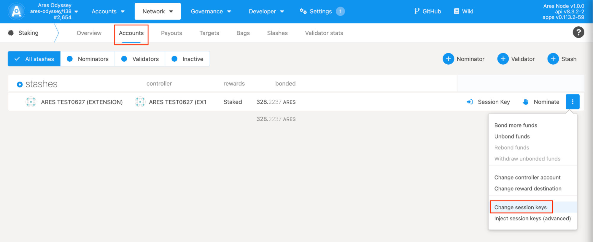
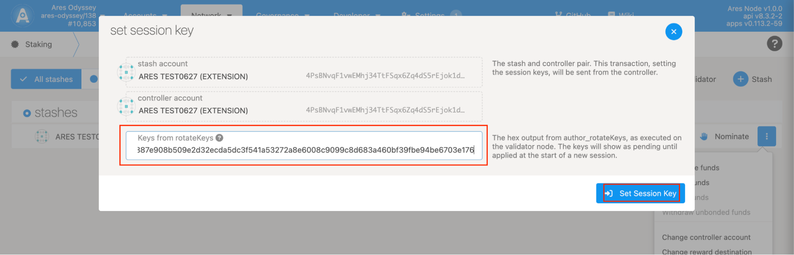

## Binary boot mode

### Step 1:
````
curl -H "Content-Type: application/json" -d '{"id":1, "jsonrpc":"2.0", "method": "author_rotateKeys", "params":[]}' http://localhost:9933
````

Output
````
{"jsonrpc":"2.0","result":"0x865cec2b50d8a16bff955c3f83501d7ed178a769f410c8557920964227cf55262be48db19f5ec8fc30706f68c7949768d9f9e943b5e4d019295b4da579618848b68b116b6e42dfd62162971efed83729f09582abd729b935a35dece66fb34615","id":1}
````
* [result] is your [rotateKeys]. Keep them safe as they will be used in setting [session key].


### Step 2:




Enter the Staking page and click the Account actions tab; select the account you need to operate and click Change session keys, then paste the public key obtained in the first step in the input box of the pop-up page, and click the Set Session Key button to confirm the submission.

## Docker set Session key

### Step 1:
````
docker exec -it ares_odyssey bash -c "apt update && apt install -y curl && curl -X POST http://localhost:9933 -H 'Content-Type: application/json' -d '{\"id\":1, \"jsonrpc\":\"2.0\", \"method\": \"author_rotateKeys\"}'"
````

Output
````
{"jsonrpc":"2.0","result":"0x74ed2791ab818797bc4a2caa78b01180cc52a5e95c8cd5286d2642b671c3986d00a93e91eaedd838f275f4c49f1c9a9c2525f7f34577c556f02bc357eddaa4dbf28ab5102be4fa22b6b8115765d290de0c6c91f37a265acecdf3782746bff32b","id":1}
````

The obtained result is used for setting the Session Key in Odyssey.


### Step 2:


Enter the Staking page and click the Account actions tab; select the account you need to operate and click Change session keys, then paste the public key obtained in the first step in the input box of the pop-up page, and click the Set Session Key button to confirm the submission.
