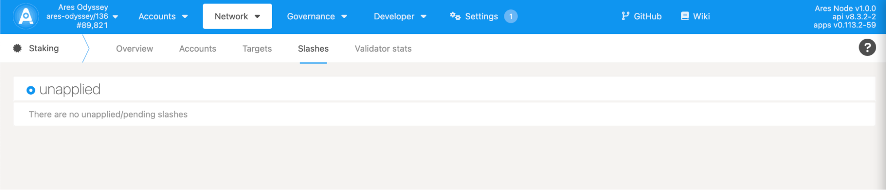
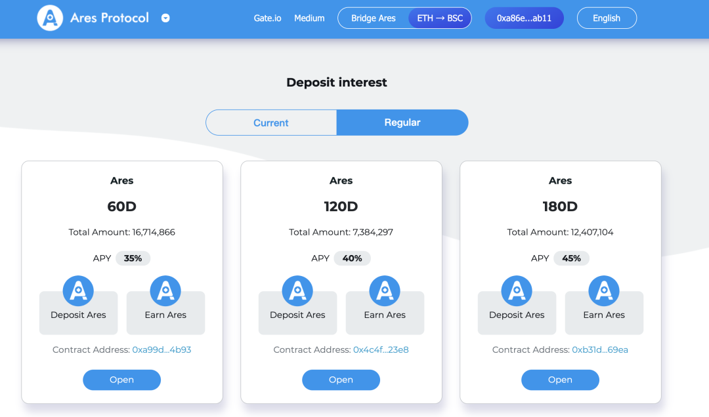
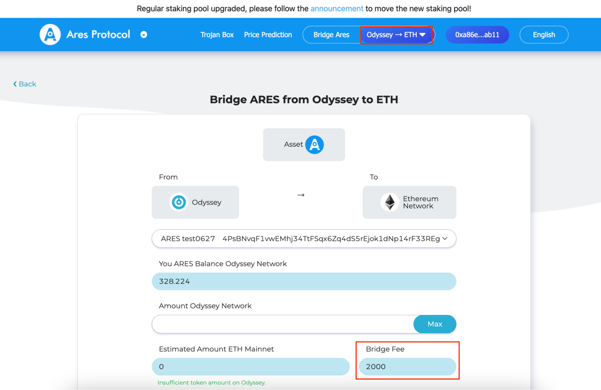
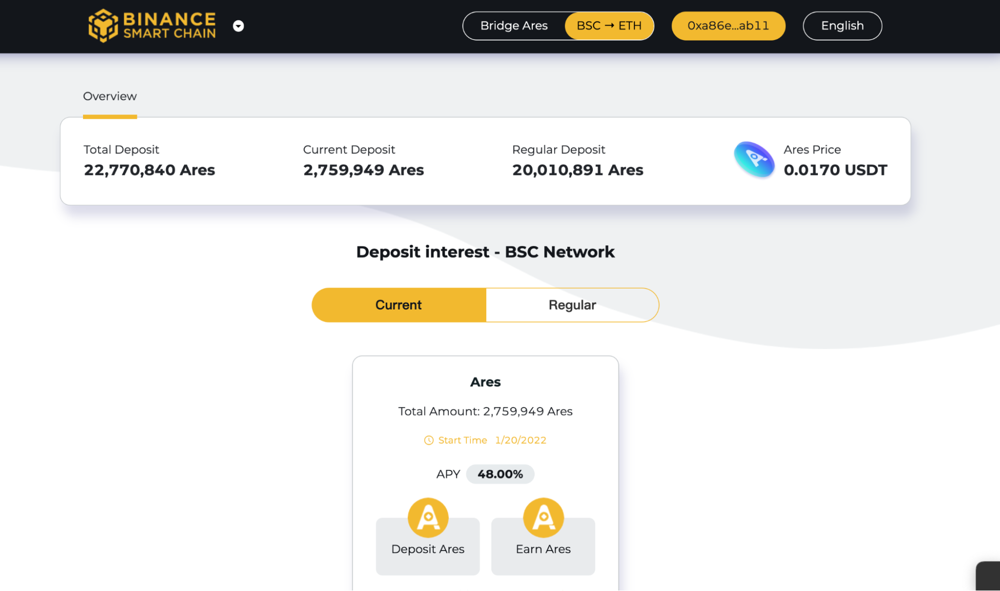
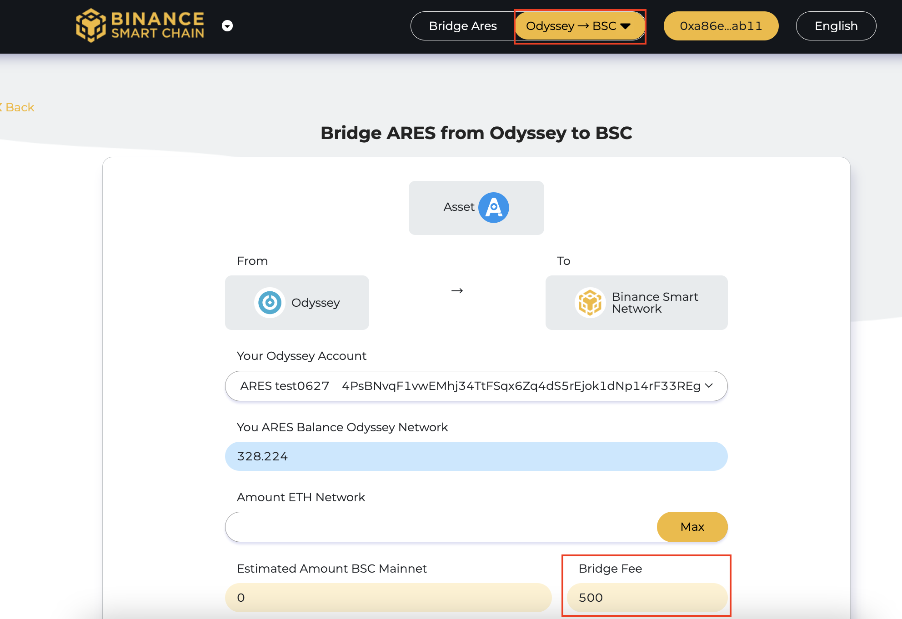

## Punishment verification

After you successfully become a validator node, you will continue to participate in block generation and quotation. The system will check in real time whether the validator has a block in the corresponding session. If there is no block, it will submit a “heartbeat request” (the validator program will automatically submit it) to prove that the validator is online. At the end of the session cycle, the node who has no block generated or heartbeat sent will be reported, and the reported validator will be punished.

### How to check if a node is penalized?

Enter the Staking page and click on the Slashes tab. When the page displays “unapplied”, no one is penalized.

If the penalty list where your account address is displayed appears on the tab page, you need to accept the punishment of kicking out of the validator set and deducting the penalty corresponding to the deposit.

## Extraction of assets

After your Odyssey network account has a certain amount of ARES assets rewarded, you can choose to withdraw to ETH or BSC network. The operation is the same as the mapping steps.

### Odyssey — ETH Network Cross-Chain Bridge
1. Connect your wallet and open the stake screen: http://trojan.aresprotocol.io/
   

2. Click on “Ares Bridge” to open the ARES asset cross-chain bridge from the Odyssey chain to the ETH network. Fill in the asset amount in the Asset Cross-Chain Bridge function interface, the system will automatically identify the ARES balance of your wallet. Fill in the amount you want to migrate to the ETH network. Confirm that the “ARES amount to be received on the ETH network”, the “cross-chain bridge fee” and your ETH account number are accurate. If they are correct, click “Confirm”.
   

⚠️Cross-chaining requires a 2000 ARES bridge fee, please make sure that the assets you are withdrawing have excess bridge fees, otherwise you will not be able to withdraw them successfully.

⚠️ Cross-chain transactions require some review time and are expected to arrive within 48 hours. If it still hasn’t arrived after 48 hours, please contact Ares Protocol Community Manager or official email address at info@aresprotocol.io. Staff will handle it for you in time.

### Odyssey -  BSC Network Cross-Chain Bridge

1. Connect your wallet
   Open the stake interface: http://iliad.aresprotocol.io/
   

2. Click on “Ares Bridge”
   Open the ARES asset cross-chain bridge fromOdyssey to the BSC network.The system will automatically recognize the ARES balance of your wallet in the Asset Bridge interface. Fill in the amount you want to migrate on the BSC network. Confirm that the “Amount of ARES to be received on BSC network”, “Cross-chain bridge fee” and your BSC account number are accurate. If they are correct, click “Confirm”.
   

⚠️Cross-chaining requires a 500 ARES bridge fee, please make sure that the assets you are withdrawing have excess bridge fees, otherwise you will not be able to withdraw them successfully.

⚠️ Cross-chain transactions require some review time and are expected to arrive within 48 hours. If it still hasn’t arrived after 48 hours, please contact Ares Protocol Community Manager or official email address at info@aresprotocol.io. Staff will handle it for you in time.

