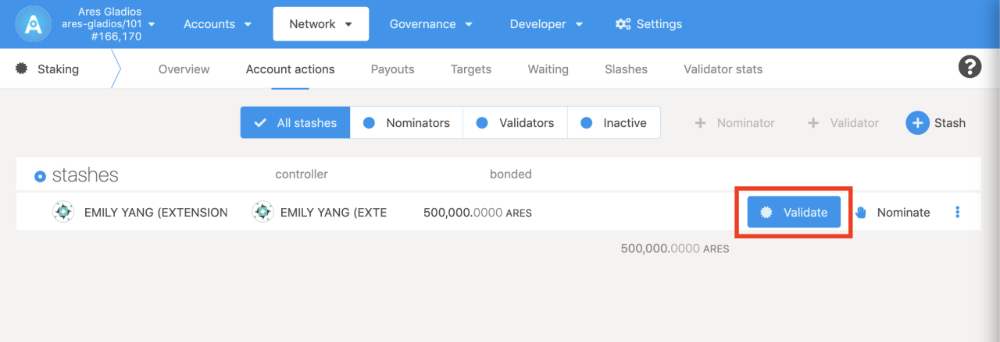
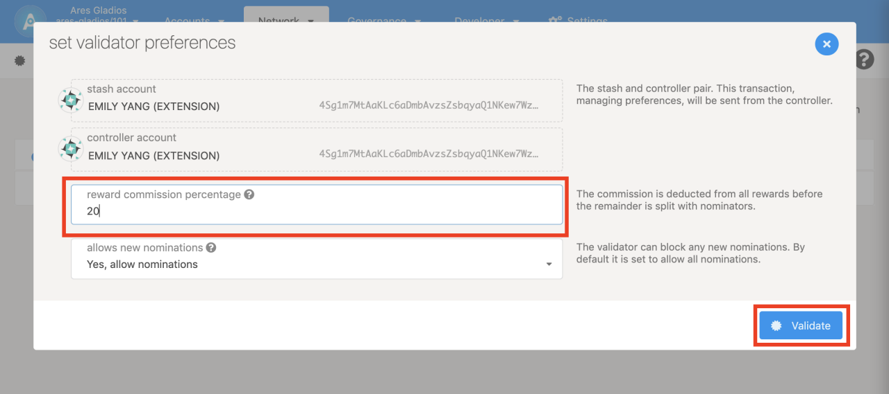

## Run the validator node




Enter the Staking page and click the Account actions tab; select the account you need to operate and click Validate, then set the reward commission percentage and allow new nominations on the pop-up page.
* Reward commission percentage sets the percentage of block reward commission (i.e. 10%, which means 10% of the block reward is earned by yourself, and the rest is distributed to the nominees proportionally. It is recommended that the commission setting should not be too high. The appropriate commission allows more people to nominate, so as to win the competition and become a validator (block node)
* Allow new nominations. The default is to allow nominations. If no nomination is allowed, you can only compete with others on the amount you stake alone. After completing the above operations, you would be able to participate in the block generation if you win the election.

## Check the status of the validator audit
The validator node's offer test data is collected once every era (4 hours), and the waiting validator submits an audit at this point. If your configuration is OK, you will become a validator in the next election.If the maximum number of Validators is full (eg: 24/24), the technical committee members are required to increase the upper limit of Validators (eg: increase to 26).

Considering that there may be problems with your own configuration, you can check the verification status of the validator on the AresScan browser.

### Validator Audit Page

https://aresscan.aresprotocol.io/ares/onchain/validator

When your validator verification result is [review], you need to click the [unpass] button to check the unpass information corresponding to your host key.

## How to check host key
### Use CLI
````
curl -H "Content-Type: application/json" -d '{"id":1, "jsonrpc":"2.0", "method": "offchain_localStorageGet", "params": ["PERSISTENT", "0x6172652d6f63773a3a6c6f63616c5f686f73745f6b6579"]}' http://localhost:9933
````

Output example:
````
{"jsonrpc":"2.0","result":"0xf9c395a5","id":1}
````
Then 0xf9c395a5 is your host key.

### Use docker
````
docker exec -it ares_odyssey bash -c "apt update && apt install -y curl && curl -H \"Content-Type: application/json\" -d '{\"id\":1, \"jsonrpc\":\"2.0\", \"method\": \"offchain_localStorageGet\", \"params\": [\"PERSISTENT\", \"0x6172652d6f63773a3a6c6f63616c5f686f73745f6b6579\"]}' http://localhost:9933"
````

Output example:
````
{"jsonrpc":"2.0","result":"0xf9c395a5","id":1}
````
Then 0xf9c395a5 is your host key.

## Check the reason of unpass status

1. [Result: Validator settings do not match]
   If the local validator set does not match the set on the chain, it is recommended that the user resets the Session Key.
2. [Result: The setting time is within 1era]
   The local set authority is matching the on-chain, but the setting time does not exceed 1era. Please wait in patience for the system to submit data.
3. [Result: Feedback data to the project side]
   The local set authority is matching the on-chain, and the setting time exceeds 1era. Users are requested to report data to the project side.

### Data feedback example

Please send back the complete debugging information of the node, including the role of the node, the status returned by the request, and the JSON format, etc. In most cases, run this command to learn about node status.

#### Use CLI
````
curl -H "Content-Type: application/json" -d '{"id":1, "jsonrpc":"2.0", "method": "ares_getInfos"}' http://localhost:9933
````
````
{
    "jsonrpc": "2.0",
    "result": {
        "node_role": "Authority",
        "request_body_checked": "Ok",
        "request_scheme_checked": "Ok",
        "request_status_checked": "Ok",
        "warehouse": "https://api.aresprotocol.io",
        "xray": 0xf9c395a5
    },
    "id": 1
}
````


#### Use docker
````
docker exec -it ares_odyssey bash -c "apt update && apt install -y curl && curl http://localhost:9933 -H \"Content-Type: application/json\" -d '{\"id\":1, \"jsonrpc\":\"2.0\", \"method\": \"ares_getInfos\"}'"
````
