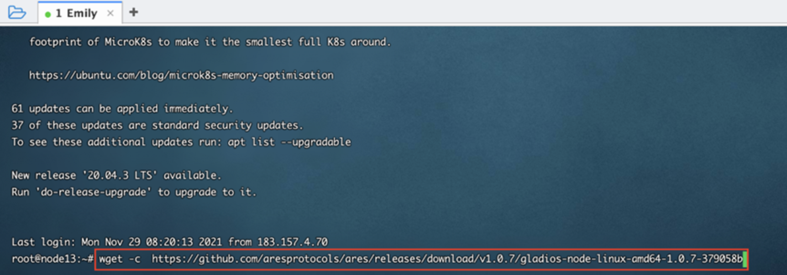
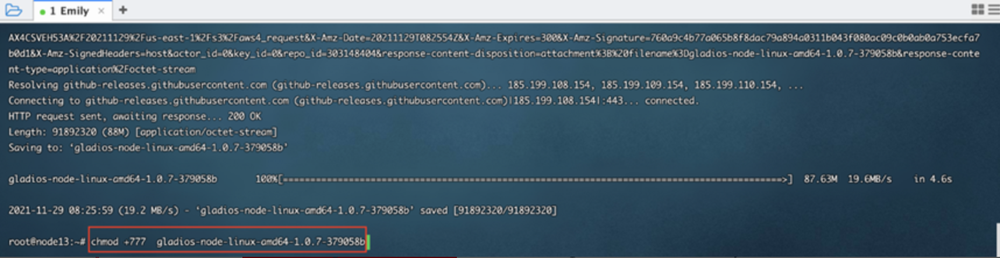
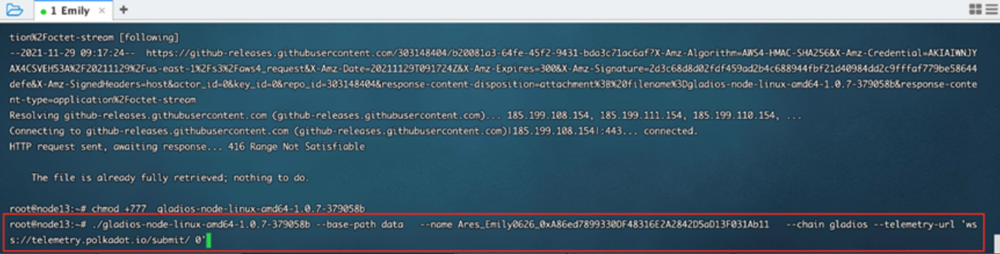
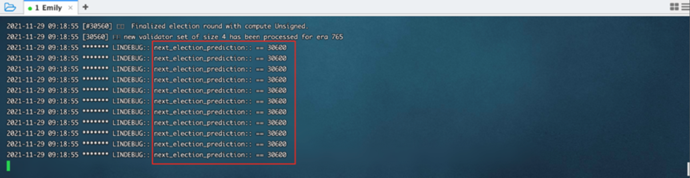

## How To Join Gladios Testnet

### **Method A: Download the Node**

#### 1. **Download Node**

download link：[<u>https://github.com/aresprotocols/ares/releases/tag/v1.1.2</u>](https://github.com/aresprotocols/ares/releases/tag/v1.1.2)



As the above photo showed, executable gladios-node binary coded files:
```
wget -c https://github.com/aresprotocols/ares/releases/download/v1.1.2/gladios-node-linux-amd64-1.1.2-39df776
```

#### 2. **Check Execution Permission**

```shell
ls -al gladios-node-linux-amd64-1.1.2-39df776
```
Output
```asm
-rwxrwxrwx  1 root  staff  89189840 11 23 21:44 gladios-node-linux-amd64-1.1.2-39df776
```
If not have **x**, Execute the following command
```shell
chmod +777  gladios-node-linux-amd64-1.1.2-39df776
```

#### 3. **Start Node**

As shown above, execute node

```shell
./gladios-node-linux-amd64-1.1.2-39df776 --base-path data   --name Ares_Emily0626_0xA86ed7899330DF48316E2A2842D5aD13F031Ab11   --chain gladios --telemetry-url 'wss://telemetry.polkadot.io/submit/ 0'
```

Please fill out in form of (Ares_username in telegram node miner group_bsc address).

for example:
Ares_Emily0626（username in telegram node miner group) _ 0xA86ed7899330DF48316E2A2842D5aD13F031Ab11（bsc address）;
Please ensure information are valid to enable evaluation and distribution of rewards.



When the server displays in the above screen, the deployment is successful. Don’t forget to log into Polkadot Telemetry to check the node running status.

**This command explain:**

* --base-path flag specify data storage directory as the **data** folder under the current directory.
* --name flag specify node name as **Ares_xxx**.
* --chain flag specify the current chain as the **gladios** testnet.
* telemetry-url flag specify the link to monitor node status as **wss://telemetry.polkadot.io/submit/ 0**,You can visit [telemetry](https://telemetry.polkadot.io/#list/0x1765d3a35ecdca975e3dc69472cc0a51780ed9ccb4481becfdddfb3c5c2be048) to view.


### **Method B：**

1.  Install docker

*   Ubuntu：

https://docs.docker.com/engine/install/ubuntu/

*   CentOs

https://docs.docker.com/engine/install/centos

*   RedHat

https://docs.docker.com/engine/install/rhel/

*   Mac

https://docs.docker.com/desktop/mac/install/

*   Windows

https://docs.docker.com/desktop/windows/install/

2.  Open the command line tool, run the command to execute the node program

```
docker run -d --name ares_gladios aresprotocollab/ares_gladios:beta gladios-node --name your-name --chain gladios --ws-external --rpc-external --rpc-cors=all --rpc-methods=Unsafe --telemetry-url 'wss://telemetry.polkadot.io/submit/ 0'

```
In the above command：aresprotocollab/ares_gladios:beta It can be changed to a different version such as：

aresprotocollab/ares_gladios:alpha；More versions please check：

https://hub.docker.com/r/aresprotocollab/ares_gladios/tags

3. View the program running log:


```
docker logs -f ares_gladios -n 1000

```

4.  Stop and delete the node program:


```
docker stop ares_gladios

docker rm ares_gladios

```


### **Method C: source code compilation**
```
Install Rust

curl --proto '=https' --tlsv1.2 -sSf https://sh.rustup.rs | sh


Install dependent libraries

sudo apt install make clang pkg-config libssl-dev build-essential

Download the Ares code

git clone [https://github.com/aresprotocols/ares.git</u>](https://github.com/aresprotocols/ares.git)

Compile the source code

cargo build --release

Note if you run into compile errors, you may have to switch to a less recent nightly. This can be done by running:

rustup install nightly-2021-06-09

rustup target add wasm32-unknown-unknown --toolchain nightly-2021-06-09

cargo +nightly-2021-06-09 build --release
```
