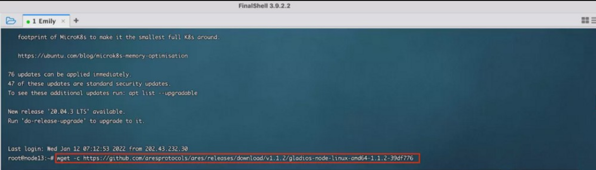
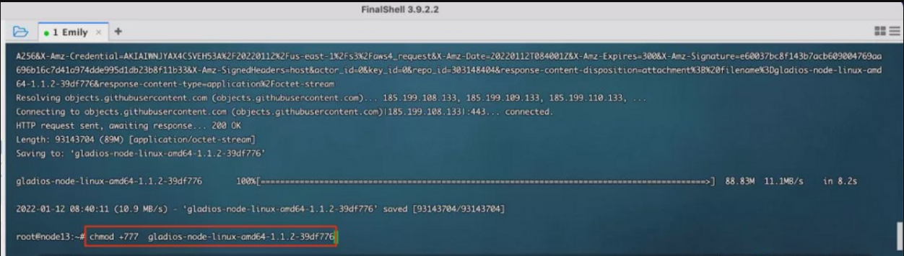
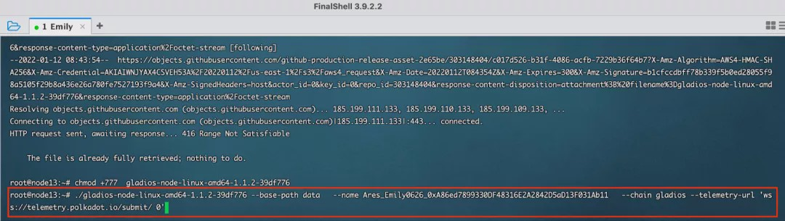
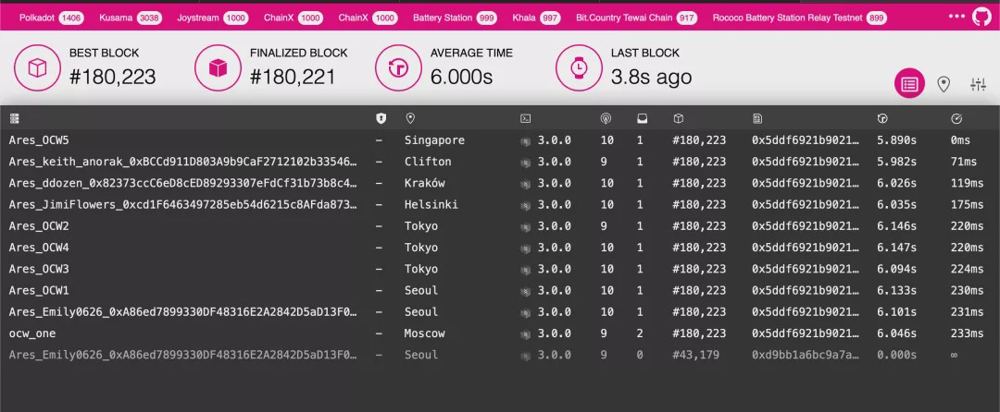

### Run Node
#### Mehod A:Run By Docker

1.Pull the latest image of the program
````
docker pull aresprotocollab/ares_gladios:latest
````

2.Open the command line tool and run the command execution node program

````
docker run -d --name ares_gladios aresprotocollab/ares_gladios:latest gladios-node --name your-name --chain gladios --telemetry-url 'wss://telemetry.polkadot.io/submit/ 0'
````

Please type your-name in the format of Ares_TelegramUsername_bsc.
Please ensure the name validity for reward counting and distribution;

for example: 
````
name Ares_Emily0626(your username in telegram node group)_0xA86ed7899330DF48316E2A2842D5aD13F031Ab11(bsc address)
````
In above command: `aresprotocollab/ares_gladios:latest` could be altered to other versions: `aresprotocollab/ares_gladios:alpha`；
for more versions please reach out to：https://hub.docker.com/r/aresprotocollab/ares_gladios/tags 

3.Check program run logs

````
docker logs -f ares_gladios  -n 1000
````

4.Stop and delete node program

````
docker stop ares_gladios
docker rm ares_gladios
````

#### Mehod B: Download Node Execution Program
Download node binary execution program:

Download address: gladios-node-linux-amd64–1.1.2–39df776

1. executable gladios-node binary file
````
wget -c https://github.com/aresprotocols/ares/releases/download/v1.1.2/gladios-node-linux-amd64-1.1.2-39df776
````




2. Add execution permit

````
chmod +777  gladios-node-linux-amd64-1.1.2-39df776
````



3. Execute Nodes

````
./gladios-node-linux-amd64-1.1.2-39df776 --base-path data   --name your-name --chain gladios --telemetry-url 'wss://telemetry.polkadot.io/submit/ 0'
````

Please type your name in (Ares_TelegramUsername_bsc) format. Please ensure the name validity for reward counting and distribution;

for example: 
````
name Ares_Emily0626（username in telegram node group）_0xA86ed7899330DF48316E2A2842D5aD13F031Ab11(BSC address).
````



#### Mehtod C: Compile Source Code

1.Instal Rust

````
curl --proto '=https' --tlsv1.2 -sSf https://sh.rustup.rs | sh
````

2. Instal dependent libraries

````
sudo apt install make clang pkg-config libssl-dev build-essential
````

3. Download Ares Code

````
git clone https://github.com/aresprotocols/ares.git
````

4. Switch to the Release1.0.1 branch

````
git checkout release1.0.1
````

5. Compile source code

````
cargo build --release
````
Note if you run into compile errors, you may have to switch to a less recent nightly. This can be done by running:
````
rustup install nightly-2021-06-09
rustup target add wasm32-unknown-unknown --toolchain nightly-2021-06-09
cargo +nightly-2021-06-09 build --release
````

### Verify Deployment Status

Log in Polkadot Telemetry
https://telemetry.polkadot.io/#list/0xcc07acbee59e89a8bc99d87a24364b514d6ae657551338547b713444583eaac2



If your name is displayed in above page, then congrats, you have successfully deployed nodes on testnet.

Log in polkadot.js to check more block updates.
http://js.aresprotocol.io/?rpc=wss%3A%2F%2Fgladios.aresprotocol.io#/explorer
