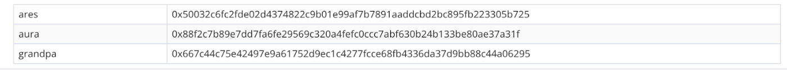

We have received several reports from the participants that they have failed to extract the data sources and failed to set the session keys which subsequently resulted in the failing of becoming a validator and keep staying in the waiting line. Here, we simplified the two ways to run the node, they are Docker or CLI. Also there are some little tips about how to set the session keys and check out your configuration status.


## Reminder of key steps

### Method A ：Use Docker

#### Run Node Services by Docker

````
docker run -d --name ares_gladios aresprotocollab/ares_gladios:latest gladios-node --name Ares_amor_4UaAfJ7EX9UsCtnUkVsbAqshH3EDN4h6Co7t8P5jPRTvLjqh --chain gladios --telemetry-url 'wss://telemetry.polkadot.io/submit/ 0'  --warehouse http://api.aresprotocol.io  --validator
````

Write your name in a format of (Ares_TelegramUsername_bsc). Please fill out with validity, to ensure the counting of rewards and distribution.

for example：
````
Ares_amor(username in telegram node miner group)_4UaAfJ7EX9UsCtnUkVsbAqshH3EDN4h6Co7t8P5jPRTvLjqh(BSC address)
````

#### Set Session Keys in Docker

````
docker exec -it ares_gladios bash -c "apt update && apt install -y curl && curl -X POST http://localhost:9933 -H 'Content-Type: application/json' -d '{\"id\":1, \"jsonrpc\":\"2.0\", \"method\": \"author_rotateKeys\"}'"
````

Output

````
{“jsonrpc”:”2.0",”result”:”0x74ed2791ab818797bc4a2caa78b01180cc52a5e95c8cd5286d2642b671c3986d00a93e91eaedd838f275f4c49f1c9a9c2525f7f34577c556f02bc357eddaa4dbf28ab5102be4fa22b6b8115765d290de0c6c91f37a265acecdf3782746bff32b”,”id”:1}
````

The result will be put in the session keys in Gladios testnet.

#### Check out Session keys local exist or not by docker

find the trade that you need to set session keys on aresscan

https://aresscan.aresprotocol.io/ares/transaction/0x95795ea49e908e0b8c8cf88a3e56f91ede63ac0795ed97b45eb345eeae833c24



session is comprised by aura,grandpa,ares 3 kinds of keys

`0x88f2c7b89e7dd7fa6fe29569c320a4fefc0ccc7abf630b24b133be80ae37a31f+667c44c75e42497e9a61752d9ec1c4277fcce68fb4336da37d9bb88c44a06295+50032c6fc2fde02d4374822c9b01e99af7b7891aaddcbd2bc895fb223305b725`

grandpa and ares need to delete the 0x in the front, that would be

`0x88f2c7b89e7dd7fa6fe29569c320a4fefc0ccc7abf630b24b133be80ae37a31f667c44c75e42497e9a61752d9ec1c4277fcce68fb4336da37d9bb88c44a0629550032c6fc2fde02d4374822c9b01e99af7b7891aaddcbd2bc895fb223305b725`

````
docker exec -it ares_gladios bash -c "apt update && apt install -y curl && curl -X POST http://localhost:9933 -H 'Content-Type: application/json' -d '{\"id\":1, \"jsonrpc\":\"2.0\", \"method\": \"author_hasSessionKeys\", \"params\": [\"0x88f2c7b89e7dd7fa6fe29569c320a4fefc0ccc7abf630b24b133be80ae37a31f667c44c75e42497e9a61752d9ec1c4277fcce68fb4336da37d9bb88c44a0629550032c6fc2fde02d4374822c9b01e99af7b7891aaddcbd2bc895fb223305b725\"]}'"
````

The searching result below , means the configuration is correct

{“jsonrpc”:”2.0",”result”:true,”id”:1}

#### Check out the data sources configuration status by docker

````
docker exec -it ares_gladios bash -c "apt update && apt install -y curl && curl -X POST http://localhost:9933 -H 'Content-Type: application/json' -d '{\"id\":1, \"jsonrpc\":\"2.0\", \"method\": \"offchain_localStorageGet\", \"params\": [\"PERSISTENT\",\"0x6172652d6f63773a3a70726963655f726571756573745f646f6d61696e\"]}'"
````

Output

````
{“jsonrpc”:”2.0",”result”:”0x68687474703a2f2f6170692e6172657370726f746f636f6c2e696f”,”id”:1}
````

If the result is：

0x68687474703a2f2f6170692e6172657370726f746f636f6c2e696f

then it’s the official data source run successfully.(if you used self built data source the result will be similiar, will not be null)

If the result is: null

The data sources for price quotation is blank, please verify the operation process and make adjustment


### Method B: Use CLI

#### Run Node Program by CLI

1. Executable gladios-node binary file

````
wget -c https://github.com/aresprotocols/ares/releases/download/v1.2.1/gladios-node-linux-amd64-1.2.1-ba392b0
````
2. Add execution permit

````
chmod +777  gladios-node-linux-amd64-1.2.1-ba392b0
````

3. Execute node

````
./gladios-node-linux-amd64-1.2.1-ba392b0 --base-path data --name Ares_amor_4UaAfJ7EX9UsCtnUkVsbAqshH3EDN4h6Co7t8P5jPRTvLjqh --chain gladios --telemetry-url 'wss://telemetry.polkadot.io/submit/ 0' --warehouse http://api.aresprotocol.io  --validator
````

Write your name in a format of (Ares_TelegramUsername_bsc). Please fill out with validity, to ensure the counting of rewards and distribution.

for example：
````
Ares_amor(username in telegram node miner group）_4UaAfJ7EX9UsCtnUkVsbAqshH3EDN4h6Co7t8P5jPRTvLjqh(BSC address)
````

#### Set session keys by CLI
````
curl -H "Content-Type: application/json" -d '{"id":1, "jsonrpc":"2.0", "method": "author_rotateKeys", "params":[]}' http://localhost:9933
````

Output

````
{“jsonrpc”:”2.0",”result”:”0x88a16ebcbb47c4c466416bf62a412910a8eee74c9b9b7fa3fe922f5f2f6b3a256ec28920cf2811088090b45c1c7faf9f5434a32929a4251667b38dcd530b9934f2fb357cf4ac2f8b024e3db8946e2ce185b8bc66f0f03d2cf5c94fa293e29f23",”id”:1}
````

Use the final result to set the session keys in gladios

#### Check out Session key local exist or not by CLI

find the trade that you need to set session key on aresscan

https://aresscan.aresprotocol.io/ares/transaction/0x95795ea49e908e0b8c8cf88a3e56f91ede63ac0795ed97b45eb345eeae833c24


session is comprised by aura,grandpa,ares 3 kinds of keys

`0x88f2c7b89e7dd7fa6fe29569c320a4fefc0ccc7abf630b24b133be80ae37a31f+667c44c75e42497e9a61752d9ec1c4277fcce68fb4336da37d9bb88c44a06295+50032c6fc2fde02d4374822c9b01e99af7b7891aaddcbd2bc895fb223305b725`

grandpa and ares need to delete the 0x in the front, that would be

`0x88f2c7b89e7dd7fa6fe29569c320a4fefc0ccc7abf630b24b133be80ae37a31f667c44c75e42497e9a61752d9ec1c4277fcce68fb4336da37d9bb88c44a0629550032c6fc2fde02d4374822c9b01e99af7b7891aaddcbd2bc895fb223305b725`

````
curl -H “Content-Type: application/json” -d ‘{“id”:1, “jsonrpc”:”2.0", “method”: “author_hasSessionKeys”, “params”:[“0x88f2c7b89e7dd7fa6fe29569c320a4fefc0ccc7abf630b24b133be80ae37a31f667c44c75e42497e9a61752d9ec1c4277fcce68fb4336da37d9bb88c44a0629550032c6fc2fde02d4374822c9b01e99af7b7891aaddcbd2bc895fb223305b725”]}’ http://localhost:9933
````

The searching result below , means the configuration is correct

````
{“jsonrpc”:”2.0",”result”:true,”id”:1}
````

#### Check out the data sources configuration status by CLI

````
curl -H "Content-Type: application/json" -d '{"id":1, "jsonrpc":"2.0", "method": "offchain_localStorageGet", "params":["PERSISTENT","0x6172652d6f63773a3a70726963655f726571756573745f646f6d61696e"]}' http://localhost:9933
````

Output
````
{“jsonrpc”:”2.0",”result”:”0x68687474703a2f2f6170692e6172657370726f746f636f6c2e696f”,”id”:1}
````
If the result is

`0x68687474703a2f2f6170692e6172657370726f746f636f6c2e696f`

then it’s the official data source run successfully.(if you used self built data source the result will be similiar, will not be null)

If the reslt is: null

The data sources for price quotation is blank, please verify the operation process and make adjustment。


## Q&A

Q: If I joined to be a candidate for validator nodes, how long I should be in the wait list?

A:
* Normally it’s 1–2 era , equal to 1–2 hours, if your configuration does not have probnlem you could also become a validator node.
* If the Validators limit is already filled (for example,24/24), then the tech. committe will lift the limit.(for example, lift it till 26).
* Other reasons, it might be your computer capacity is not met by the requirement for running a node.

Q: Why my node tend to be offline?

A: While you are operating without cloud server, it will be easily offline in your computer’s sleeping mode. If you are operating with cloud server, it’s better to set a screen session and run the program in the background, this will help to prevent from being offline.
