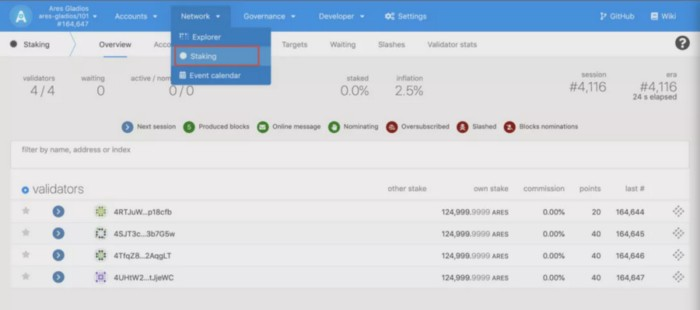
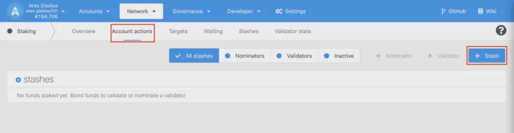
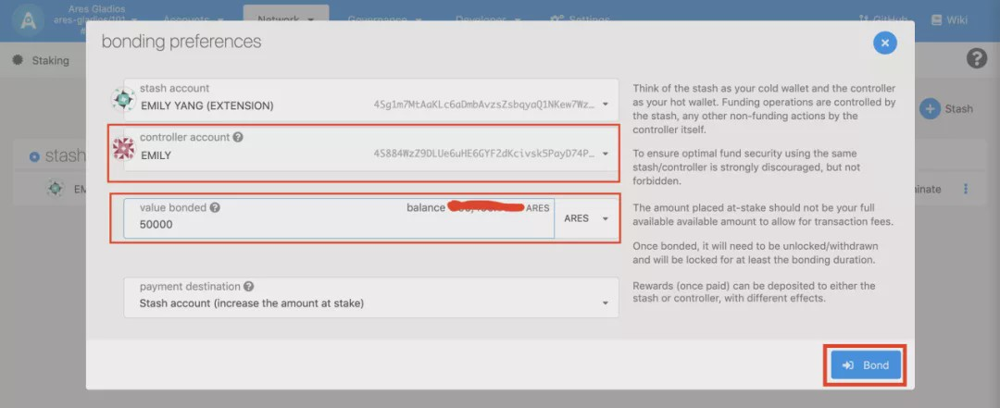
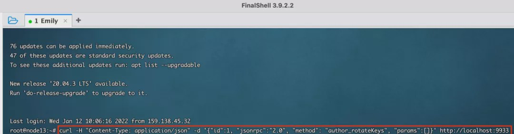
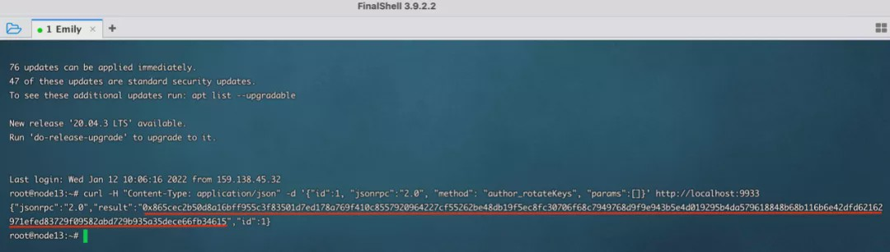
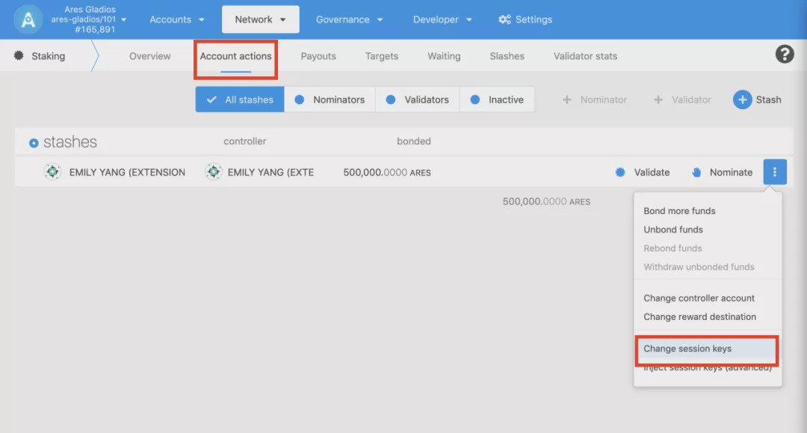
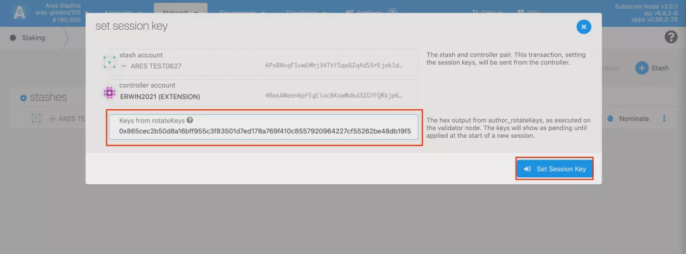
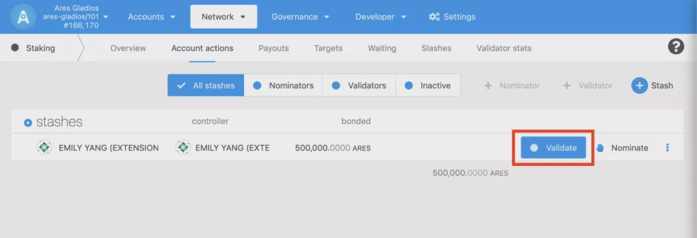
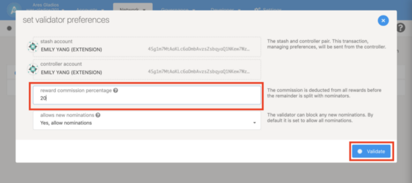

### Stake

#### First Step

Open https://js.aresprotocol.io/?rpc=wss%3A%2F%2Fgladios.aresprotocol.io#/explorer





As shown above, enter staking page, click [Account actions], click Stash button.

#### Second Step




Select the stach account (for staking) and relevant controller account. Stash and controller could be one account, but for practical purpose, we highly do not recommend to use one account. Please fill out the staking amount according to your personal interest, The staked mount will be deducted from your stach account.

* A Stash account can be perceived as your cold wallet, where the operation of funds is controlled by a Stash account
* Controller account, other non-fund operations are done by controller (such as: setting sessionKeys, setting commission, participating in voting, releasing pledge, etc.)
* Staking amount. Do not pledge all available balances, but set aside some for transaction fees.

After fulfilling the above info, click Bond button to complete the staking procedure.

### Produce Block (be a validator node)

#### First step: run node

If use docker:

````
docker run -d --name ares_gladios aresprotocollab/ares_gladios:latest gladios-node --name your-name --chain gladios --telemetry-url 'wss://telemetry.polkadot.io/submit/ 0' --warehouse http://api.aresprotocol.io  --validator
````

If use CLI:

````
./gladios-node-linux-amd64-1.2.1-ba392b0 --base-path data --name your-name --chain gladios --telemetry-url 'wss://telemetry.polkadot.io/submit/ 0' --warehouse http://api.aresprotocol.io  --validator
````


parameters:(compulsory) — warehouse specifies IP address of ares price quotation server.

parameters:(compulsory) — validator specifies running a validator node.

#### Second step: Set Session Keys

If use docker:
````
docker exec -it ares_gladios bash -c "apt update && apt install -y curl && curl -X POST http://localhost:9933 -H 'Content-Type: application/json' -d '{\"id\":1, \"jsonrpc\":\"2.0\", \"method\": \"author_rotateKeys\"}'"
````

If use CLI:
````
curl -H "Content-Type: application/json" -d '{"id":1, "jsonrpc":"2.0", "method": "author_rotateKeys", "params":[]}' http://localhost:9933
````


Output

````
{"jsonrpc":"2.0","result":"0x865cec2b50d8a16bff955c3f83501d7ed178a769f410c8557920964227cf55262be48db19f5ec8fc30706f68c7949768d9f9e943b5e4d019295b4da579618848b68b116b6e42dfd62162971efed83729f09582abd729b935a35dece66fb34615","id":1}
````



「result」is your「rotateKeys」save them, you will use it in「session key」


Open https://js.aresprotocol.io/?rpc=wss%3A%2F%2Fgladios.aresprotocol.io#/explorer

Enter Staking page and click on the Account Actions tab; Select the account you want to operate, click Change Session Keys, enter the pasted result “rotateKeys”, and click the Set Session Key button to confirm the submission.





#### Step 3: Become the validator

Open https://js.aresprotocol.io/?rpc=wss%3A%2F%2Fgladios.aresprotocol.io#/explorer

Enter Staking page and click on the Account Actions tab; Select the account you want to operate, click Validate, and on the pop-up page set reward commission percentage and allow new nominations.





* Reward Commission Percentage

  Set a commission percentage for reward(for block producing); for example, 10 percent, then 10 percent of the reward(for block producing) is earned by the node and the rest is distributed proportionally to the nominee. The commission setting is suggested to be set in moderate percentage to attract more people to nominate the node, so as to win the competition to become the validator node(blockproducing node).
* Do you allow new nominations?

  The default is to allow nominations. If you choose to not allow nomination, then you are supposed to compete with others only by the amount you staked.

After completing the above operations, if you win from nomination, you will be authorised to become a block producer(as a validator node).

