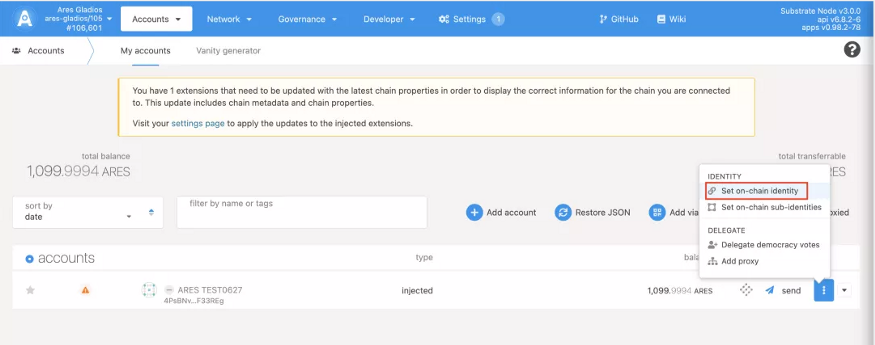
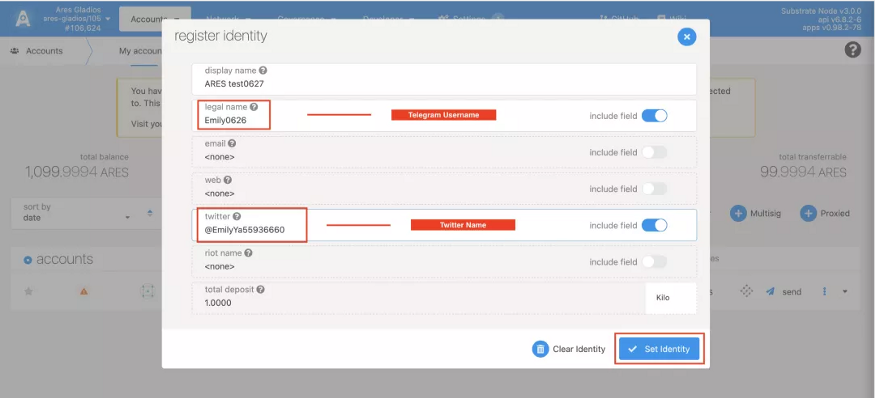
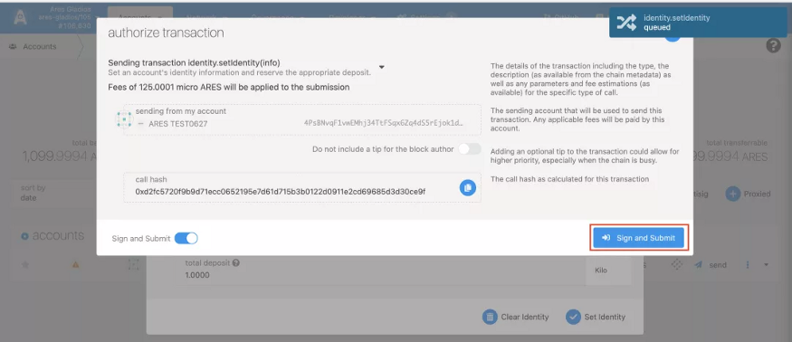
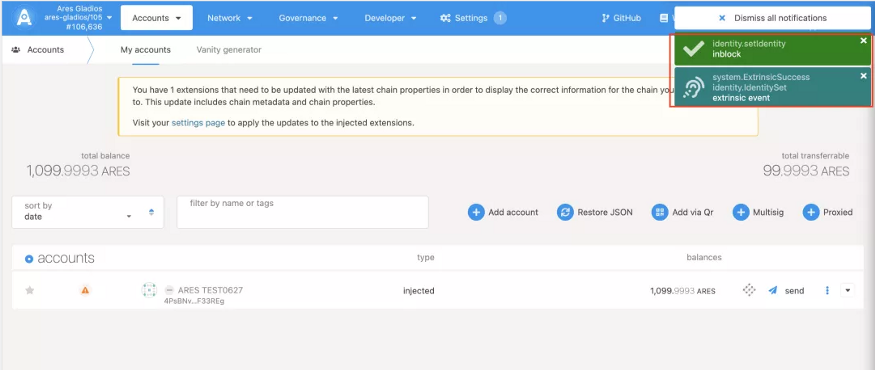
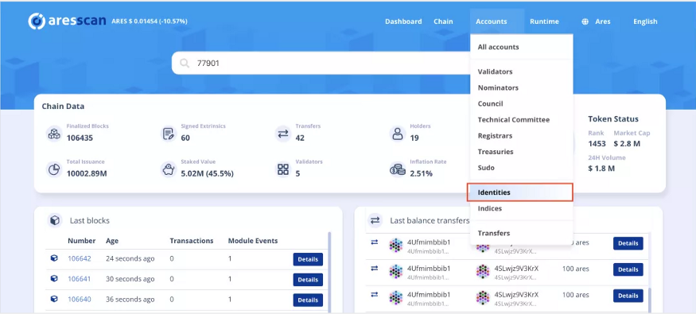
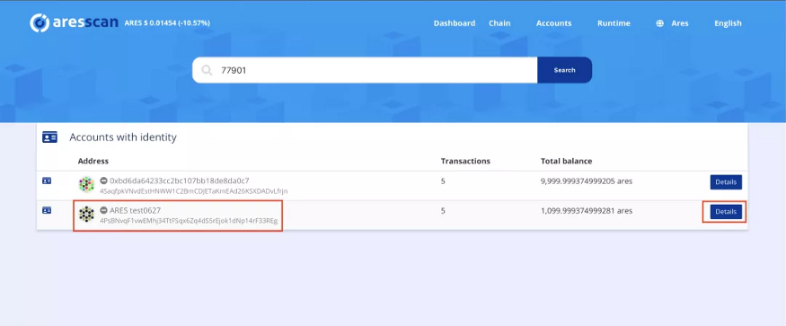
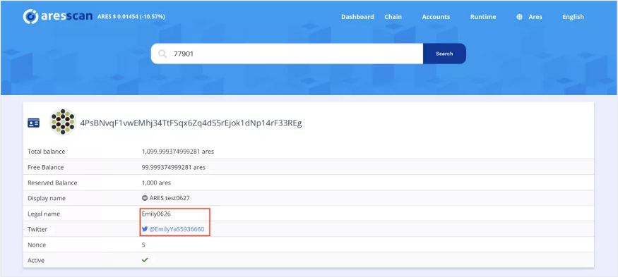

Suppose you want to become a validator node or to experience on-chain identity. In that case, you could set your on-chain identity on Gladios, fill out your Telegram name and Twitter name to ensure we could access to check your operating status or distribute relevant rewards.

1. Log in Gladios, click [Accounts] in the top table, click[My accounts], as in the photo below, choose [set on-chain identity] 

   Gladios：http://js.aresprotocol.io/?rpc=wss%3A%2F%2Fgladios.aresprotocol.io#/explorer

2. Put your telegram name in [ledge name], put twitter name in [Twitter name], and click [set identity]

3. Confirm the trade and click [Sign and submit] (This will charge you certain test coins, please ensure 1000 or above test coins in your account address)

4. After the trade completion, it will notify you that your identity has been set.

5. Enter AresScan ( https://aresscan.aresprotocol.io/ares ), click [account], choose[identity].

6. Click your name and click the [details] option

7. Check if your [Telegram Username] and [Twitter name] are correct. The community administrator will contact you soon to ask for your BSC address. You will get a reward for the second phase.

