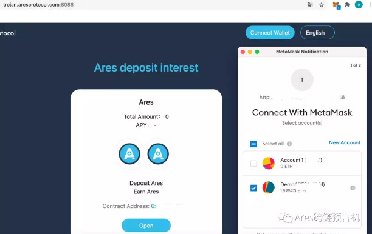
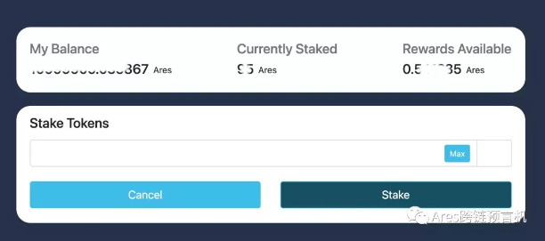
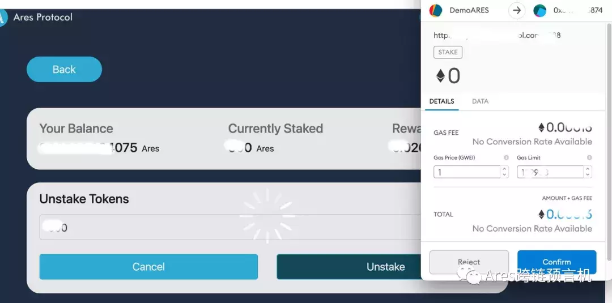
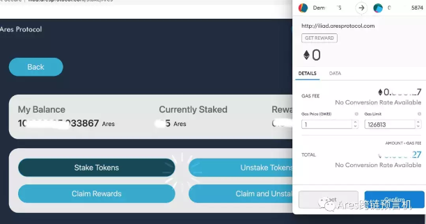

## General Outlook
Since May 13th this year, Ares Trojan Staking mining was officially deployed in the Ethereum main network and now we are welcoming the third phase of Staking mining, thank you all for your active participation!

Ares mining has been carried out for third periods, and the Staking volume continues to rise. We can see the enthusiasm of everyone involved. The current Staking amount plus the reward is 45,970,000. All along, we hope to give more rewards to our Aresians. Stake mining reward adjusted from the starting 625000 to a million of the third round. The annualized yield held steadily at 26 %.

With the release of the 2nd Seed Wheel Institutional Token, Ares has launched Regular-term mining products in order to better give-back to the community, Ares enthusiasts can pledge their tokens to regular-term contracts for more mining rewards.

### Why Choose Regular Products?
Currently, we have been in a volatile market, in order to avoid the fluctuations of market to bring about the loss of income, At the same time, it’s also to give back to the loyal fans who are optimistic about the Ares project for a long time. After a series of discussions, the team decided to launch regular-term products with higher annualized returns.

From now on we will launch the following regular Staking mining products: regular-term mining products are divided into three grades, which are 60 days, 120 days and 180 days respectively. The APY of 60 days is 35%; The APY of 120 days is 40%; The APY of 180 days is 45%.

### Please Recognize the Contract Address:

60 days: 0xa99d9fA06Dd1827fD39aB2d6E0d8eb1DaE9C4B93

120 days: 0x4C4f6d9FAe70236888C4D613199Ea4419ada23E8

180 days: 0xb31d8EBa3f5e2D758b54544E4446b39F9cb769ea

### What Should We Pay Attention to When Participating in Regular Stake Mining?
 After purchasing regular products, the principal cannot be redeemed within the specified time, but the reward can be received anytime.

For the purchase of regular products, if you want to purchase additional regular products during the Staking mining time, you need to extend the overall period. Redemption days= completion days before additional purchase + regular days (60/20/180).

For example, David used $100 Ares to regular mine for 60 days. After 30 days, he decided to spend another $100 Ares and purchase an additional 60 days to mine. In this way, 200$ Ares will take 90 days to redeem. At this point, the income is about 100*35%/12+200*35%/6

Regular-term products can be redeemed after expiration. If they are not redeemed in time, the system will give the corresponding income according to the cycle you chose.
For example, David chooses to order 120 days products with $100 Ares with an annualized yield of 40%, and he redeems it in 150 days. Then David’s income at this point is about 100*40%/12*5.

**Current Products**

Ares stake volume stably made up for 60% of the whole circulation, which has been reached Polkadot's staking level.

Trojan Stake Mining Adress : [https://trojan.aresprotocol.io](https://trojan.aresprotocol.io/)

**Operating Steps**

This tutorial presents you with the staking conception and interface of the Ares Trojan Stake Mining. Once you get familiar with the operation process, you will be more confident in your vision of profit-making.

**Notice: Stake mining requires authorized trade of Metamask. If you are not aware of how to set up the Metamask, then you could make some research to acknowledge relevant skills.**

**1\. Login in your Metamask and switch the network to Ethereum Mainnet**

**2.Add Ares token into matamask**

Put in below address to log in Etherscan，add ARES into Metamask 

[https://etherscan.io/token/0x358aa737e033f34df7c54306960a38d09aabd523](https://etherscan.io/token/0x358aa737e033f34df7c54306960a38d09aabd523)

**3\. Connect your wallet**

Open stake mining page:[https://trojan.aresprotocol.io/](https://trojan.aresprotocol.io/)

**4\.  Main steps**

**4.1 Stake Mining**

**4.1.1 Process of approval**

If this is the first time to connect in Trojan，you need to fulfil the below process

**4.1.2 Stake Mining**

While the approval was successfully made, you could click"Stake Tokens", and you could put in the amount to stake tokens. Once the trade was made, in a Currently Staked forum, it is shown your staked amount, and profit will be accumulated in each sec.

Notice: due to the ethereum mainnet, please be aware of your Gas fee amount. If the approval process is too long then try to check your network connection, or consider adding a certain amount of Gas fee to speed up.

**4.2 Unstake**

Click "Unstake Tokens", to claim your Ares tokens。 Put in your unstake amount，and click "Unstake"。

**4.3 Claiming Rewards**

Click "Claim Rewards" and check Gas fee, after you confirmed, click“Confirm" to claim rewards.

**4.4 Claim rewards and Unstake**

You could use this function to terminate staking.
