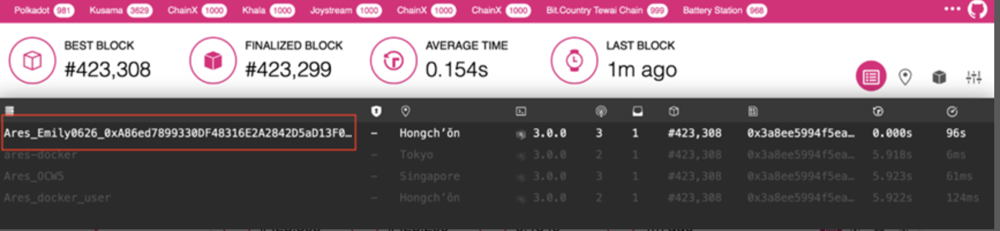

### Verifying Deployment Status
**Log in Polkadot Telemetry**

https://telemetry.polkadot.io/#/0x1ff9888c17c1e30395e0abc7071f5e607d231528375dce789c95fe67850a3ef7



If your name is shown on this page, then congratulations, you are successfully deployed nodes on the test network — gladios. Next, let’s make efforts together for the development of the project to gain common prosperity.
Log into polkadot.js to check more block updates

https://polkadot.js.org/apps/?rpc=wss%3A%2F%2Fgladios.aresprotocol.io/#/explorer

**Operation steps**

**Create an Ares account**

**Accounts**

**How to open the following interface to access** 

[<u>https://js.aresprotocol.io/?rpc=wss%3A%2F%2Fgladios.aresprotocol.io#/explorer/</u>](https://js.aresprotocol.io/?rpc=wss%3A%2F%2Fgladios.aresprotocol.io#/explorer)

### create Account

first step

 

Enter Ares APPS, click "Account" in the navigation bar at the top of the window, and click "Add Account", as shown in the figure above.

Second step

 

The **Mnemonic Seed** value of this account. Make sure you save the **mnemonic seed** in a safe place and check "I have safely saved my mnemonic seed"

third step

 

Enter your account name and password, and click "Next"

the fourth step

 

Click "Save" and the account will be backed up to your device by default. Please keep your backup files.

transfer

first step

 

Generate an account and click "Send", as shown in the figure above.

Second step

 

Enter the transfer address and quantity in the station, and click "Transaction", as shown in the figure above

third step

 

Save the "call hash" of this transaction, click "sign and submit" to proceed to the next step

the fourth step

 

Enter the password of your account, click "Transaction Signature", and the transfer is completed. Quickly notify your trading users and check it in time!

Run validator node

**Staking**

1.  Staking

first step：

 

 

As shown above: Enter the Staking page, click "Account actions" and then click the Stash button

Second step：

 

Select the stash account to be pledged and the corresponding controller account. Stash and the controller can be the same account, but it is strongly not recommended in practice. Fill in the amount to be pledged (value bonded) according to the demand, and the pledge deposit amount is deducted from the stash account.

* The stash account can be thought of as your cold wallet, and the operation of funds is controlled by the stash account.
* Controller account, other non-funding operations are done by the controller (such as: setting sessionKeys, setting commissions, participating in voting, removing pledges, etc.)
* Pledge deposit amount, don’t use all available balance to pledge, leave some for transaction fees

After filling in the above information, click the Bond button to complete the pledge operation.

1.  Block out (become a validator)

first step：

Run node：

```
./target/release/gladios-node --base-path /tmp/aura/one --name ocw_one --port 30333 --ws-port 9945 --rpc-port 9933 --ws-external --rpc-external --rpc-cors=all --rpc-methods=Unsafe --telemetry-url 'wss://telemetry.polkadot.io/submit/ 0' --warehouse https://api.aresprotocol.io/ --bootnodes /ip4/158.247.224.166/tcp/30333/p2p/12D3KooWEyoppNCUx8Yx66oV9fJnriXwCcXwDDUA2kj6vnc6iDEp --validator
```

Parameters: (required) --warehouse is used to specify the IP address of the ares quotation server.

Parameters: (optional) --ares-keys is used to load the corresponding key-strore through a private key file.

--ares-keys file format internal format：

aura:(Mnemonic phrase)//1//aura

gran:(Mnemonic phrase)//1//grandpa
Parameters: (required) --validator is used to start a validator node.

Parameters: (required) --bootnodes is used to connect to the startup node.

ares-keys可用author.rotateKeys代替

1.  Generate Aura key: Need to specify sr25519 format.
2.  Generate GRANDPA key: Need to develop ed25519 format.

 

 

Enter the RPC Calls page, call the method author.rotateKeys, click the button Submit RPC Call, and then the server will return the public key (publicKey); copying the public key is needed in the second step.

Note⚠️: The above operation (first step) should be performed on the node you deployed or trusted node. Because the private key (privateKey) corresponding to the generated public key will be stored in the keystore of the node.

CLI[<u>​</u>](https://wiki.polkadot.network/docs/maintain-guides-how-to-validate-polkadot#option-2-cli)

curl -H "Content-Type: application/json" -d '{"id":1, "jsonrpc":"2.0", "method": "author_rotateKeys", "params":[]}' http://localhost:9933

Second step：

 

 

Go to the Staking page and click the Account actions tab; select the account you need to operate, click Change session keys, paste the public key obtained in the first step in the input box of the pop-up page, and click the Set Session Key button to confirm the submission.

third step

 

 

Enter the Staking page and click the Account actions tab; select the account you need to operate, click Validate, and set the reward commission percentage and whether to allow new nominations on the pop-up page.

* Commission percentage (reward commission percentage)

Set the block reward commission percentage; for example, 10%, then 10% of the block reward is your own income, and the remaining part is proportionally distributed to the nominator. It is recommended that the commission setting is not too high. Only with a suitable commission can more people be nominated and win the competition and become a validator (block producer)

* Whether to allow nominations (allow new nominations)

The default is to allow nominations. If no nomination is not allowed, you can only compete with others on the amount you pledged.

After completing the above operations, if you win the election, you can participate in the block production.